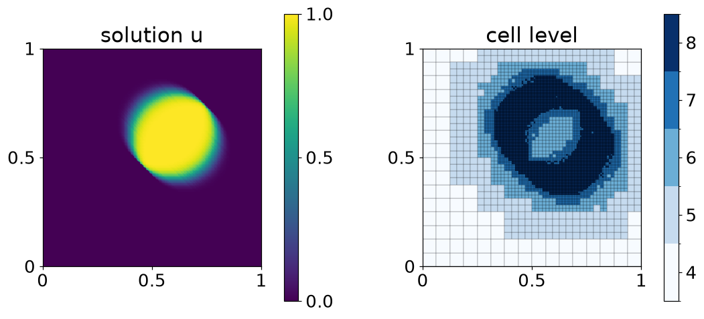

<h1 align="center">
  <a href="https://github.com/hpc-maths/samurai">
    <picture>
        <source media="(prefers-color-scheme: dark)" height="160" srcset="./docs/source/logo/dark_logo.png">
        
    </picture>
  </a>
</h1>

<div align="center">

[](https://github.com/hpc-maths/samurai/actions/workflows/ci.yml)
[](https://hpc-math-samurai.readthedocs.io)
[](https://anaconda.org/conda-forge/samurai)
[](LICENSE)

</div>

samurai is a header-only C++20 library for researchers and engineers who write finite volume or lattice Boltzmann solvers on adaptive Cartesian meshes, with multiresolution or adaptive mesh refinement (AMR), sequential or with MPI.

<div align="center">
  
</div>

*The program below transports a disc with an upwind scheme until t reaches 0.3. Multiresolution keeps the finest cells (level 8) along the edge of the disc and coarsens the rest of the domain down to level 4: the final mesh has 13,333 cells, against 65,536 for a uniform mesh at level 8.*

samurai stores the mesh as intervals of cells and finds the cells a scheme needs with a set algebra on these intervals (intersection, union, difference, change of level).
Multiresolution and AMR both work on this data structure.

## Try it

Install samurai, a compiler and CMake from conda-forge:

```bash
conda install -c conda-forge samurai cxx-compiler cmake make
```

This program solves the advection equation on the adaptive mesh of the figure.
Save it as `main.cpp`:

```cpp
#include <cmath>
#include <samurai/io/hdf5.hpp>
#include <samurai/mr/adapt.hpp>
#include <samurai/mr/mesh.hpp>
#include <samurai/schemes/fv.hpp>

int main(int argc, char* argv[])
{
    samurai::initialize(argc, argv);

    // Unit square, cells from level 4 (side 1/16) to level 8 (side 1/256)
    const samurai::Box<double, 2> box({0., 0.}, {1., 1.});
    auto config = samurai::mesh_config<2>().min_level(4).max_level(8);
    auto mesh   = samurai::mra::make_mesh(box, config);

    // u = 1 inside the disc of center (0.3, 0.3) and radius 0.2, 0 outside
    auto u = samurai::make_scalar_field<double>("u", mesh, [](const auto& x)
    {
        return std::hypot(x[0] - 0.3, x[1] - 0.3) <= 0.2 ? 1. : 0.;
    });
    samurai::make_bc<samurai::Dirichlet<1>>(u, 0.);

    // Transport u with the velocity (1, 1) until t reaches 0.3
    samurai::VelocityVector<2> velocity = {1., 1.};
    auto conv         = samurai::make_convection_upwind<decltype(u)>(velocity);
    auto MRadaptation = samurai::make_MRAdapt(u);
    auto unp1         = samurai::make_scalar_field<double>("unp1", mesh);
    const double dt   = 0.5 * mesh.min_cell_length();
    for (double t = 0.; t < 0.3; t += dt)
    {
        MRadaptation(samurai::mra_config().epsilon(2e-4)); // adapt the mesh to u
        unp1.resize();
        unp1 = u - dt * conv(u);                           // upwind scheme
        samurai::swap(u, unp1);
    }
    samurai::save("advection", mesh, u); // advection.h5 and advection.xdmf

    samurai::finalize();
}
```

Next to it, create `CMakeLists.txt`:

```cmake
cmake_minimum_required(VERSION 3.16)
project(advection CXX)

find_package(samurai REQUIRED)

add_executable(advection main.cpp)
target_link_libraries(advection PRIVATE samurai::samurai)
```

Build and run:

```bash
cmake -S . -B build -DCMAKE_BUILD_TYPE=Release
cmake --build build
./build/advection
```

The program writes `advection.h5` and `advection.xdmf`; open the `.xdmf` file in [ParaView](https://www.paraview.org) to see the solution and the mesh.
The [getting started tutorial](https://hpc-math-samurai.readthedocs.io/en/latest/tutorial/getting_started.html) explains each step of this program and how to plot the level of each cell.

## Features

- Adaptive Cartesian meshes in 1D, 2D and 3D, stored as intervals of cells
- Set algebra on intervals to build subsets of the mesh and apply a computation on them, within a level or between levels
- Mesh adaptation with cell-based multiresolution (MRA) and cell-based adaptive mesh refinement (AMR)
- Complex domains built from a set of boxes
- Finite volume schemes defined by their numerical fluxes, explicit or assembled into matrices with PETSc
- Lattice Boltzmann schemes on multiresolution meshes ([demos/LBM](./demos/LBM))
- HDF5 and XDMF output, read by ParaView
- Distributed-memory parallelism with MPI, with load balancing

## Documentation

The documentation is on [Read the Docs](https://hpc-math-samurai.readthedocs.io):

- [Tutorials](https://hpc-math-samurai.readthedocs.io/en/latest/tutorial/index.html): from a first adaptive simulation to intervals, fields, set algebra and graduation.
- [How-to guides](https://hpc-math-samurai.readthedocs.io/en/latest/howto/index.html): install samurai, set up a CMake project, adapt a mesh, save and plot results.
- [Reference](https://hpc-math-samurai.readthedocs.io/en/latest/reference/index.html): boundary conditions, set algebra, finite volume schemes and load balancing.
- [API](https://hpc-math-samurai.readthedocs.io/en/latest/api/index.html): the C++ classes and functions, generated from the headers.
- [Hands-on samurai](https://hpc-maths.github.io/2025-hands-on-samurai/): a course that goes from multiresolution meshes and fields to finite volume solvers for the Burgers and Euler equations.

Complete programs are in the [demos](./demos) directory, grouped by method (finite volume, lattice Boltzmann, WENO, multigrid, MPI), and in the [samurai gallery](https://hpc-maths.github.io/samurai-gallery/).

Changes between versions are listed in [CHANGELOG.md](./CHANGELOG.md) and on the [releases page](https://github.com/hpc-maths/samurai/releases).

## Installation

From conda-forge, with conda, mamba or micromamba:

```bash
conda install -c conda-forge samurai
```

From Spack:

```bash
spack install samurai
spack load samurai
```

From source, to run the demos or work on samurai:

```bash
git clone https://github.com/hpc-maths/samurai
cd samurai
conda env create --file conda/environment.yml
conda activate samurai-env
conda install -c conda-forge cxx-compiler
cmake -S . -B build -G Ninja -DCMAKE_BUILD_TYPE=Release -DBUILD_DEMOS=ON
cmake --build build
```

The [installation guide](https://hpc-math-samurai.readthedocs.io/en/latest/howto/installation.html) gives the packages for MPI and PETSc, the Spack variants and the options of a source build.

### MPI, PETSc and OpenMP options

The option that turns MPI on has two names, because it belongs to two CMake projects:

- `-DWITH_MPI=ON` configures the samurai repository itself: it builds the demos, tests and benchmarks with MPI.
- `-DSAMURAI_WITH_MPI=ON` configures your own project: it is an option of the `samuraiConfig.cmake` that `find_package(samurai)` reads.

PETSc and OpenMP follow the same rule (`WITH_PETSC` and `SAMURAI_WITH_PETSC`, `WITH_OPENMP` and `SAMURAI_WITH_OPENMP`).
The [CMake project guide](https://hpc-math-samurai.readthedocs.io/en/latest/howto/cmake.html) lists the options of a downstream project and shows how to check the ones a program was built with.

## Get help and contribute

- Ask questions on [GitHub Discussions](https://github.com/hpc-maths/samurai/discussions).
- Report a bug or request a feature with the [issue forms](https://github.com/hpc-maths/samurai/issues/new/choose).
- Read the [contributing guide](./docs/CONTRIBUTING.md) to set up a development environment and open a pull request. All participants follow the [code of conduct](./docs/CODE_OF_CONDUCT.md).

## Citation

If you use samurai in your work, cite the repository, <https://github.com/hpc-maths/samurai>, the version you used and the authors listed in [AUTHORS.txt](./AUTHORS.txt).
A program built with samurai prints the version when you run it with `--info`.
A `CITATION.cff` file is in preparation in [pull request #602](https://github.com/hpc-maths/samurai/pull/602).

## License

samurai is distributed under the BSD-3-Clause license. See [LICENSE](LICENSE).
