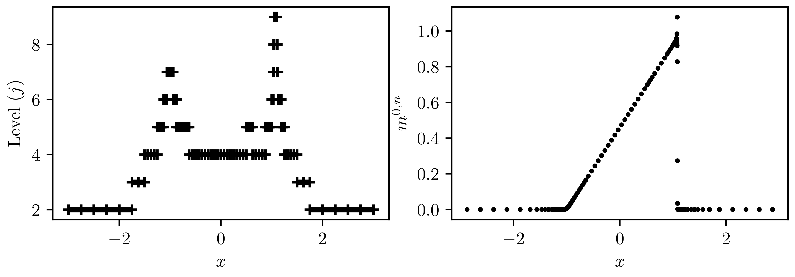
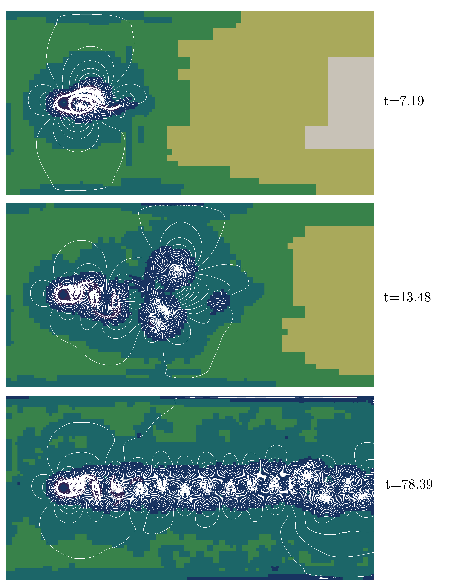

Test cases LBM-MR
==========================================

D1Q2 scheme for the advection and the Burgers equations
-----------------------------

The corresponding files are ``D1Q2_Advection_and_Burgers.cpp`` for the plot of the solution and ``test_D1Q2.cpp`` to perform the computations presented in the paper.

The target problem is the conservation law

.. math::
    \partial_{t} u + \partial_{x} (\varphi(u)) = 0, \qquad \text{with} \quad \begin{cases}
                                                                                \varphi(u) = 3/4u, \qquad &\text{advection}, \\
                                                                                \varphi(u) = u^2/2, \qquad &\text{Burgers}.
                                                                             \end{cases}

We consider many initial data.

* For the advection equation:

.. math::
    u_1(t = 0, x) = e^{-20x^2}, \qquad u_2 (t=0, x) = \chi_{|x| < 1/2}(x).

* For the Burgers equation

.. math::
    u_3(t=0, x) = (1 + \text{tanh}(100x))/2, \qquad u_4(t = 0, x) = (1+x) \chi_{[-1, 0]}(x) + (1-x) \chi_{[0, 1]}(x), \qquad u_5 (t=0, x) = \chi_{|x| < 1/2}(x).

D1Q3 and D1Q5 schemes for the shallow waters system
-----------------------------

The corresponding files are ``D1Q3_Shallow_Waters_Dam.cpp`` and ``D1Q5_Shallow_Waters_Dam.cpp`` for the plot of the solution and ``test_D1Q3.cpp`` and ``test_D1Q5.cpp`` to perform the computations presented in the paper.

The problem is the shallow waters system to simulate a dam failure

.. math::
    \begin{cases}
        \partial_t h &+ \partial_x (h u ) = 0, \\
        \partial_t (hu) &+ \partial_x (hu^2 + gh^2/2 ) = 0, \\
        h(t = 0, x) &= 2 \chi_{x < 0}(x) + \chi_{x \geq 0}(x), \\
        u(t=0, x) &= 0,
    \end{cases}

with gravity constant :math:`g = 1`.
This initial datum develops a left travelling rarefaction fan and a right travelling shock wave.

.. image:: ./figures/D1Q5.png
    :width: 100%
    :align: center

Vectorial D1Q222 scheme for Euler system
-----------------------------

The corresponding files are ``D1Q222_Euler_Sod.cpp`` for the plot of the solution and ``test_D1Q222.cpp`` to perform the computations presented in the paper.

The system we aim at approximating is given by

.. math::
    \begin{cases}
        \partial_t \rho + \partial_x (\rho u) = 0, \\
        \partial_t (\rho u) + \partial_x (\rho u^2 + p) = 0, \\
        \partial_t E + \partial_x(Eu + pu) = 0, \\
        \rho(t=0, x) = \chi_{x < 0}(x) + 1/8 \chi_{x \geq 0}(x), \\
        u(t=0, x) = 0, \\
        p(t=0, x) = 5/2\chi_{x < 0}(x) + 1/4 \chi_{x \geq 0}(x), \\
    \end{cases}

with pressure law given by :math:`E = \rho u^2/2 + p/(\gamma+1)`, where :math:`\gamma` is the gas constant taken equal to 1.4.

.. image:: ./figures/D1Q222.png
    :width: 100%
    :align: center

Vectorial D2Q4444 scheme for Euler system for the Lax-Liu problem
-----------------------------

The corresponding file is ``D2Q4444_Euler_Lax_Liux.cpp`` for the plot of the solution to perform the computations presented in the paper.

The system we consider is

.. math::
    :label: eq_EulerSystem

    \begin{cases}
        \partial_t \rho + \partial_x (\rho u) + \partial_x (\rho v) = 0, \\
        \partial_t (\rho u) + \partial_x (\rho u^2 + p) + \partial_y (\rho uv) = 0, \\
        \partial_t (\rho v) + \partial_x (\rho uv) + \partial_y (\rho v^2 + p) = 0, \\
        \partial_t E + \partial_x (Eu + pu) + \partial_y (Ev + pv) = 0,
    \end{cases}

with pressure law given by :math:`E = \rho u^2/2 + p/(\gamma+1)`, where :math:`\gamma` is the gas constant taken equal to 1.4.
The initial datum is the following

.. math::
        (\rho, u, v, p)(t = 0, x) =
        \begin{cases}
            (\rho_{\text{UR}}, u_{\text{UR}}, v_{\text{UR}}, p_{\text{UR}}), \qquad &x > 1/2, \quad y > 1/2, \\
            (\rho_{\text{UL}}, u_{\text{UL}}, v_{\text{UL}}, p_{\text{UL}}), \qquad &x < 1/2, \quad y > 1/2, \\
            (\rho_{\text{LL}}, u_{\text{LL}}, v_{\text{LL}}, p_{\text{LL}}), \qquad &x < 1/2, \quad y < 1/2, \\
            (\rho_{\text{LR}}, u_{\text{LR}}, v_{\text{LR}}, p_{\text{LR}}), \qquad &x > 1/2, \quad y < 1/2.
        \end{cases}

.. image:: ./figures/D2Q4444.png
    :width: 100%
    :align: center

D2Q9 scheme for incompressible Navier-Stokes system for Von Karman vortexes
-----------------------------

The corresponding file is ``D2Q9_Navier_Stokes_von_Karman_street.cpp`` for the plot of the solution to perform the computations presented in the paper.

Considering an obstacle :math:`\Theta \subset \Omega`, where :math:`\Omega` is the computational domain, the target system is given by

.. math::
    \begin{cases}
        \nabla \cdot \mathbf{u} = 0, \qquad t \geq 0, \quad &\mathbf{x} \in \Omega \smallsetminus \Theta, \\
        \rho_0 \left ( \partial_t \mathbf{u} + \mathbf{u} \cdot \nabla \mathbf{u} \right ) = -\nabla p + \nabla \cdot  \left ( 2 \mu \dfrac{\nabla \mathbf{u} + \nabla \mathbf{u}^T}{2} \right ), \qquad t \geq 0, \quad &\mathbf{x} \in \Omega \smallsetminus \Theta, \\
        \mathbf{u} = 0, \qquad t \geq 0, \quad &\mathbf{x} \in \partial \Theta, \\
        \mathbf{u}(t=0, \mathbf{x}) = (u_0, 0), \qquad &\mathbf{x} \in \Omega \smallsetminus \Theta.
    \end{cases}

The numerical method is consistent with this system in the limit of small velocity and being in a quasi-incompressible regime.
Observe that the method conserves :math:`\rho` (which shall remain close to :math:`\rho_0`) and :math:`\rho \mathbf{u}`.

Vectorial D2Q4444 scheme for Euler system for the implosion problem
-----------------------------

The initial datum is [eq_EulerSystem]

.. math::
    (\rho, u, v, p)(t=0, x, y) = (1/8 \chi_{|x|+|y| \leq 1/2} + \chi_{|x|+|y| > 1/2}, 0, 0, 7/50 \chi_{|x|+|y| \leq 1/2} + \chi_{|x|+|y| > 1/2}).

The boundary conditions are

.. math::
    \text{Left and right} \quad
    \begin{cases}
        \rho ~ : ~ &\text{Bounce-back}\\
        \rho u ~ : ~ &\text{Anti Bounce-back}\\
        \rho v ~ : ~ &\text{Bounce-back}\\
        E ~ : ~ &\text{Bounce-back}
    \end{cases}
    \qquad \text{Top and bottom} \quad
    \begin{cases}
        \rho ~ : ~ &\text{Bounce-back}\\
        \rho u ~ : ~ &\text{Bounce-back}\\
        \rho v ~ : ~ &\text{Anti Bounce-back}\\
        E ~ : ~ &\text{Bounce-back}
    \end{cases}

Vectorial D2Q5444 scheme for Euler system for the Rayleigh-Taylor instability
-----------------------------

The system we consider is the Euler system with a gravitational forcing of intensity :math:`g > 0`

.. math::
    \begin{cases}
        \partial_t \rho + \partial_x (\rho u) + \partial_x (\rho v) = 0, \\
        \partial_t (\rho u) + \partial_x (\rho u^2 + p) + \partial_y (\rho uv) = 0, \\
        \partial_t (\rho v) + \partial_x (\rho uv) + \partial_y (\rho v^2 + p) = -\rho g, \\
        \partial_t E + \partial_x (Eu + pu) + \partial_y (Ev + pv) = -vg.
    \end{cases}

The boundary conditions we enforce on the system are

.. math::
    \text{Left and right} \quad
    \begin{cases}
        \rho ~ : ~ &\text{Copy}\\
        \rho u ~ : ~ &\text{Anti Bounce-back}\\
        \rho v ~ : ~ &\text{Bounce-back}\\
        E ~ : ~ &\text{Bounce-back}
    \end{cases}
    \qquad \text{Top and bottom} \quad
    \begin{cases}
        \rho ~ : ~ &\text{Copy}\\
        \rho u ~ : ~ &\text{Bounce-back}\\
        \rho v ~ : ~ &\text{Anti Bounce-back}\\
        E ~ : ~ &\text{Bounce-back}
    \end{cases}

.. image:: ./figures/D2Q5444_Rayleigh_Taylor_cropped.png
    :width: 100%
    :align: center
