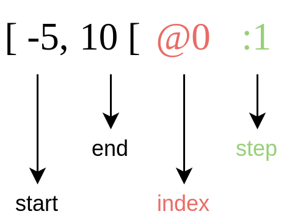
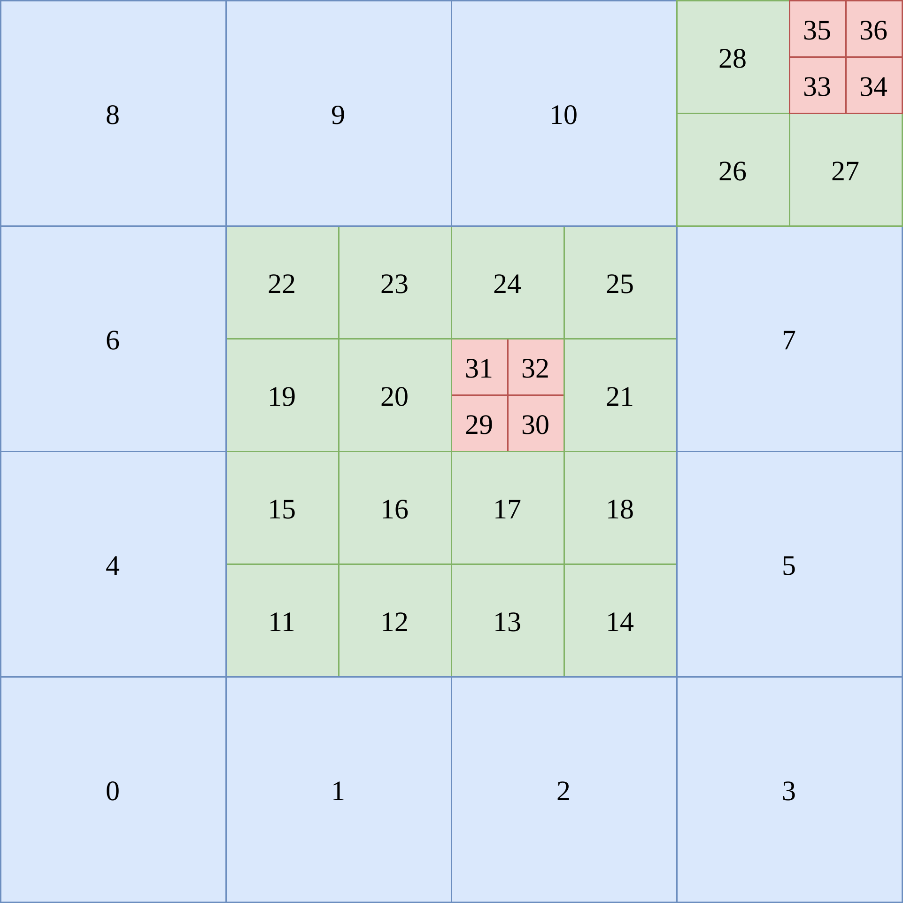

Interval and cartesian grid representation
==========================================

The data structure widely used by |project| is an interval. An interval is described as follows

The end value of the interval is not included. The step is used when you want to browse the interval. The index is used as on offset on other data structures and more details will be given in the following.

Another important point is that the start and the end values are integers but they have to be able to represent a cartesian grid with different refinement levels and then, real numbers. A space step can be defined with the level of the refinement with this formula

.. math::

    \Delta x = \frac{1}{2^{level}}.

Therefore, the space step is fixed by the level and the same in each direction. An interval at :math:`level + 1` is two more refined than at :math:`level`.

Let's take a 1D example with various levels.

.. image:: ./figures/interval_example_1D.png
    :width: 100%
    :align: center

For each level, the intervals are:

- level 0: :math:`[0, 2[`, :math:`[5, 6[`
- level 1: :math:`[4, 7[`, :math:`[8, 10[`
- level 2: :math:`[14, 16[`

And the real intervals given by the level and :math:`\Delta x` are

- level 0: :math:`[0., 2.[`, :math:`[5., 6.[`
- level 1: :math:`[3., 3.5[`, :math:`[4., 5.[`
- level 2: :math:`[3.5, 4.[`

The discretization of the 1D domain is done and you want to compute a solution on it. That is where the index comes in. The entries of the solution are contiguous in the x-direction which is obvious for 1D problem and contiguous by level beginning by the lower level (here at :math:`level = 0`).

For each interval, the index plus the start of the interval must be equal to the entry of the solution. Therefore, the intervals can be rewritten as

- level 0: :math:`[0, 2[@0`, :math:`[5, 6[@-3`
- level 1: :math:`[4, 7[@-1`, :math:`[8, 10[@-2`
- level 2: :math:`[14, 16[@-7`

The following code uses |project| to make exactly the 1D domain described previously

.. literalinclude:: snippet/interval.cpp
  :language: c++

The output is

.. literalinclude:: snippet/interval_output.txt

Two new data structures are used in this example `CellList` and `CellArray` which are arrays of size `max_level` defined as a template parameter. The default size is 16.

`CellList` is used to efficiently add new intervals when the mesh is constructed. As its name suggest, `CellList` is nothing more than a list of intervals in the x-direction. This list is stored into a map where the keys are the index in the other dimensions and the values are the list. This data structure is efficient to add new elements in :math:`O(1)`. But when you want to browse the intervals and apply scientific computing algorithms such as numerical schemes with a stencil, it's no more efficient.

`CellArray` is used to compress the representation of the mesh where each dimension has its own interval list and an offset array to point to the corresponding intervals of the lower dimension `d-1` for each element of the interval of dimension `d`.

The example below will help to better understand the idea.

.. image:: ./figures/2D_mesh.png
    :width: 80%
    :align: center

The `CellList` associated with this mesh is

.. code::

    level 0:
        y: 0
            x: [0, 4[
        y: 1
            x: [0, 1[, [3, 4[
        y: 2
            x: [0, 1[, [3, 4[
        y: 3
            x: [0, 3[

    level 1:
        y: 2
            x: [2, 6[
        y: 3
            x: [2, 6[
        y: 4
            x: [2, 4[, [5, 6[
        y: 5
            x: [2, 6[
        y: 6
            x: [6, 8[
        y: 7
            x: [6, 7[

    level 2:
        y: 8
            x: [8, 10[
        y: 9
            x: [8, 10[
        y: 14
            x: [14, 16[
        y: 15
            x: [14, 16[

And the `CellArray` is

.. code::

    level 0:
        x: [0, 4[, [0, 1[, [3, 4[, [0, 1[, [3, 4[, [0, 3[
        y: [0, 4[@0
        y-offset: [0, 1, 3, 5, 6]

    level 1:
        x: [2, 6[, [2, 6[, [2, 4[, [5, 6[, [2, 6[, [6, 8[, [6, 7[
        y: [2, 8[@-2
        y-offset: [0, 1, 3, 5, 6, 7, 8]

    level 2:
        x: [8, 10[, [8, 10[, [14, 16[, [14, 16[
        y: [8, 10[@-8, [14, 16[@-12
        y-offset: [0, 1, 2, 3, 4]

It is important to understand that the index represented by the symbol `@` in y-intervals allows having the start of an interval in the `y-offset` array.

Let's take level 2 and choose `y=14`. Thus, y-offset entry should be 2. This why index is `-12`: `start + index = 14 - 12 = 2`.

Now, we want to attach a field to this mesh to perform numerical computations on it. The number of cells for the field is defined by the sum of the size of each x-interval for each level. The numbering is done by starting at the coarsest level.

Once again, the index represented by the `@` operator will be used to navigate into the field entries. But this time, we modify this index in the x-intervals. `CellArray` becomes

.. code::

    level 0:
        x: [0, 4[@0, [0, 1[@4, [3, 4[@2, [0, 1[@6, [3, 4[@4, [0, 3[@8
        y: [0, 4[@0
        y-offset: [0, 1, 3, 5, 6]

    level 1:
        x: [2, 6[@9, [2, 6[@13, [2, 4[@17, [5, 6[@16, [2, 6[@20, [6, 8[@20, [6, 7[@22
        y: [2, 8[@-2
        y-offset: [0, 1, 3, 5, 6, 7, 8]

    level 2:
        x: [8, 10[@21, [8, 10[@23, [14, 16[@19, [14, 16[@21
        y: [8, 10[@-8, [14, 16[@-12
        y-offset: [0, 1, 2, 3, 4]

The implementation of this example is

.. literalinclude:: snippet/2d_mesh_representation.cpp
  :language: c++

And the output is

.. literalinclude:: snippet/2d_mesh_representation_output.txt
