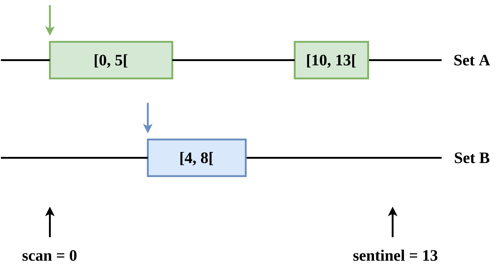

.. _AlgebraOfSet:

Algebra of set
==============

The second core ingredient of |project| is the possibility to construct a subset from sets of intervals. It is useful when you want to navigate between levels and implement operators used when two or more sets have interaction.

Imagine the following 1D mesh

.. image:: ./figures/subset_1d.png
    :width: 60%
    :align: center

And we want to make the projection of the cells from level 1 to level 0 by computing the mean of the values as illustrate by this figure

.. image:: ./figures/subset_1d_proj.png
    :width: 60%
    :align: center

Using an algebra of set, we can describe the subset as the intersection of the cells of level 1 with the cells of level 0.

The following code performs the projection on this intersection

.. literalinclude:: snippet/subset_1d.cpp
  :language: c++

And the output is

.. literalinclude:: snippet/subset_1d_output.txt

The relevant part in this code is these few lines

.. code-block:: c++

    // Make projection on the intersection
    auto subset = samurai::intersection(ca[0], ca[1]).on(0);
    subset([&](const auto& i, auto)
    {
        u(0, i) = 0.5*(u(1, 2 * i) + u(1, 2 * i + 1));
    });

There are two different parts:

- the construction of the subset

.. code-block:: c++

    auto subset = samurai::intersection(ca[0], ca[1]).on(0);

In |project|, you already have an algebra of set operators implemented (`intersection`, `difference`, `union`, `translation`, ...). And you can easily create your operator as we will see in the following. The subset can be made up of sets of different levels. Since the intervals of these sets are represented by integers, it is important to be able to compare these integers at the same level. By default, the common level is the finest (here `level = 1`). But we want to apply our operator on another level. This is why we specify it using `.on(0)`.

- the numerical computation on this subset

.. code-block:: c++

    subset([&](const auto& i, auto)
    {
        u(0, i) = 0.5*(u(1, 2 * i) + u(1, 2 * i + 1));
    });

If the subset exists, we can then apply a numerical kernel to it. There exist different ways: `operator()`, `apply_op` where you describe an operator which can be different depending on the problem dimension. The method using `operator()` as in our example takes a lambda function with two parameters: an x-interval and an index array with the values for the other dimensions. Since our example is a 1d problem, we omit the index.

How to find the subset ?
------------------------

The 1d algorithm with intervals at the same level is really simple to understand and can be illustrated by the following steps.

**Initialization step**

We want to create the subset of two sets A and B which is their intersection. Each set starts at the beginning of their first interval. We define two other variables: `scan` which will navigate in the sets and `sentinel` which will tell us that we are at the end of the set. At the beginning of the algorithm, `scan` is the minimum value of the starts of the first interval of each set and `sentinel` the maximum value of the ends of the last interval of each set + 1.

**Step 1**

.. image:: ./figures/subset_algorithm-step1.png
    :width: 60%
    :align: center

We begin the algorithm to see if `scan` is in the current interval of each set. Here, `scan` is only in A. We want the intersection of A and B which means that `scan` must be in A and B. This is not the case here so we update `scan`: if the current value of a set is equal to `scan`, we move the current value to the next value (the end of the current interval or the beginning of a new one). Then, we update `scan` with the minimum value of the current value of each set.

Note that `out` is the possible result of this subset and needs to be populated to be valid.

**Step 2**

.. image:: ./figures/subset_algorithm-step2.png
    :width: 60%
    :align: center

This time, `scan` is in A and B and thus the intersection expression is valid. We can start the possible result of the subset materialized by `out`. Therefore, `out` starts by 4. And we update the current value of each set and `scan` accordingly.

**Step 3**

.. image:: ./figures/subset_algorithm-step3.png
    :width: 60%
    :align: center

`scan` is no more in A which means that we are outside the interval result. Since it is the first outside value encountered, we can close `out` with this one. We now have our first result: the intersection of A and B contains the interval `[4, 5[`. We can apply a function to it if defined like in your first example with the `operator()`.

And we update again the current value of each interval and `scan` accordingly.

**Step 4**

.. image:: ./figures/subset_algorithm-step4.png
    :width: 60%
    :align: center

We can continue the algorithm. Since `out` was populated previously, we have to begin a new interval result. We can see in this example that there are no more intervals that can be in the intersection of A and B. The current value of each interval will be updated until the sentinel value is reached. Then, `scan` will be equal to `sentinel` and the algorithm will stop.

We can observe that it is easy to construct more complex subset since we just have to modify the formula :math:`x_{A \cap B} = scan \in A \; \text{and} \; scan \in B`. For example, if we want the union, the formula becomes :math:`x_{A \cup B} = scan \in A \; \text{or} \; scan \in B`.

How to manage the level ?
-------------------------

The sets used to define the subset can be at different levels. Since the mesh is described using integers, we need to project each set on the same level to be able to compare the intervals and the subset makes sense. This figure illustrates the purpose

.. image:: ./figures/subset_level.png
    :width: 60%
    :align: center

On level 0, we have the interval :math:`[1, 3[` and on level 1 the interval :math:`[0, 5[`. We want to compute the intersection of these two sets. Without projection, the result is :math:`[1, 3[` and we can see that it is wrong.

In |project|, we have two ways to define the level of the result:

- if we don't mention it, then the biggest level is chosen.
- we can mention it using the method `on(level)`.

Example:

.. code-block:: c++

    auto subset = intersection(setA, setB);
    // or
    auto subset = intersection(setA, setB).on(level);

With the first version, our example gives the result :math:`[2, 4[` since the default level is the biggest one (here 1). And the second version with `on(0)` gives the result :math:`[1, 2[`.

Internally, it means that we have to shift the value of the intervals of a set before to compute `scan` and `sentinel` values. But when we have to know if `scan` is in the interval, we need to shift `scan` to go back to the level of the set.

The other important thing is if we use `on(level)` and the level is biggest than the biggest level of the sets composing the subset, then it is not necessary to project the intervals on `level` since we can reconstruct the result from the result interval founded from the biggest level of the sets. In our example, if we use `on(3)`, the result is  :math:`[8, 16[` which is nothing less than the result on the default level with a shift :math:`[2 << s, 4 << s[` with :math:`s=on_{level} - default_{level}`.

Recursion on the dimension
--------------------------

Since the beginning, the algorithm is made on 1d problem. The problems manage by |project| are not only 1d problem. Then the algorithm must work for the largest dimensions (2, 3, 4, ...). Recall that the data structure used to store the mesh is `LevelCellArray` where we have an array of size `dimension` composed for each dimension by an array of intervals and an array of size `dimension - 1` for the offsets.

.. code::

    x: [0, 4[@0, [0, 1[@4, [3, 4[@2, [0, 1[@6, [3, 4[@4, [0, 3[@8

    y: [0, 4[@0
    y-offset: [0, 1, 3, 5, 6]

    z: [0, 1]@0
    z-offset: [0, 1]

If we take independently each dimension, we can observe it is once again 1d problem with a list of intervals. It means that we can apply the algorithm previously defined beginning by the largest dimension and decrement the dimension `d` to `d-1` when we have found a result interval on `d` until the dimension `0` is reached.
