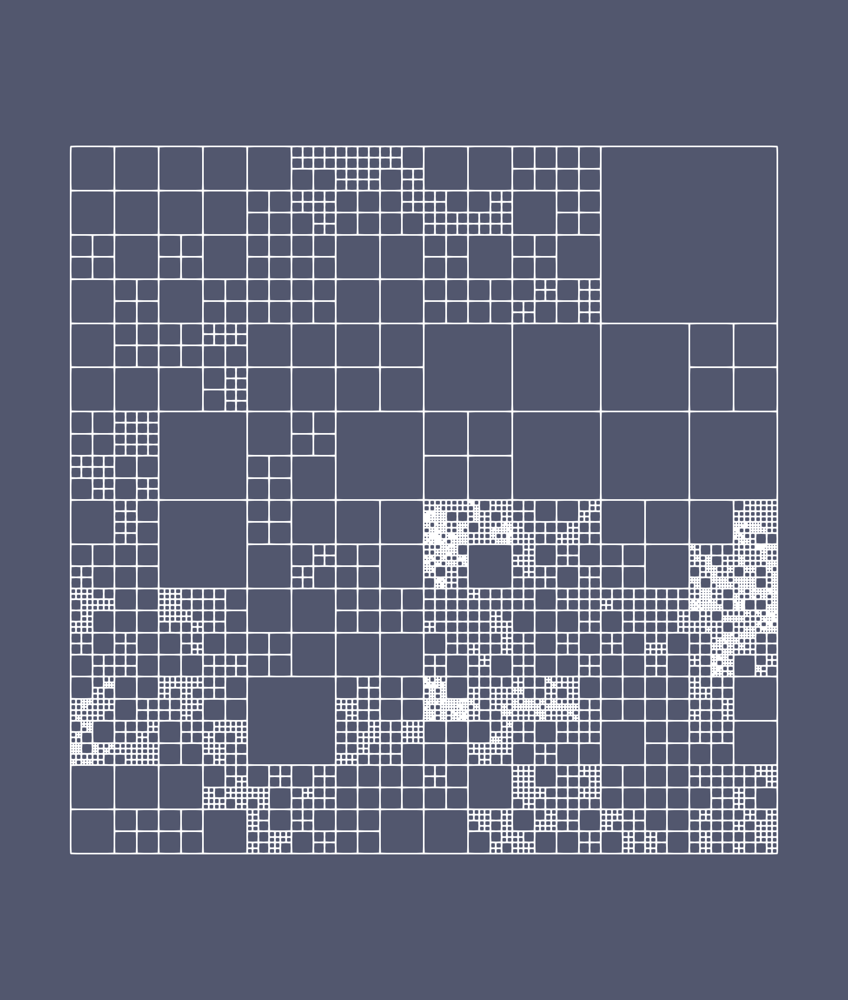
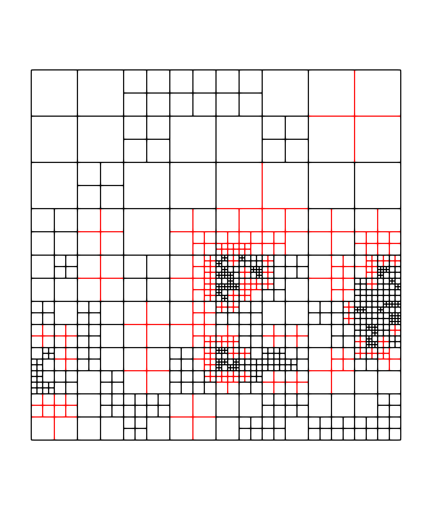

Graduation example: case 1
==========================

In this tutorial, the mesh is constituted of cells at different levels but without overlap and we want a graduated mesh at the end. The complete example can be downloaded here: :download:`graduation case 1 <../../../demos/tutorial/graduation_case_1.cpp>`

First, we need an initial mesh with this property. We will generate it randomly beginning by level :math:`1` in the 2D domain :math:`[0, 1] \times [0, 1]`. The idea is to refine randomly the cells of a given level and to create a new mesh. The implementation of the initial mesh is described in the following code.

.. code-block:: c++

    auto generate_mesh(std::size_t start_level, std::size_t max_level)
    {
        constexpr std::size_t dim = 2;
        samurai::Box<int, dim> box({0, 0}, {1<<start_level, 1<<start_level});
        samurai::CellArray<dim> ca;

        ca[start_level] = {start_level, box};

        for(std::size_t ite = 0; ite < max_level - start_level; ++ite)
        {
            samurai::CellList<dim> cl;

            samurai::for_each_interval(ca, [&](std::size_t level, const auto& interval, const auto& index)
            {
                auto choice = xt::random::choice(xt::xtensor_fixed<bool, xt::xshape<2>>{true, false}, interval.size());
                for(int i = interval.start, ic = 0; i<interval.end; ++i, ++ic)
                {
                    if (choice[ic])
                    {
                        cl[level + 1][2*index].add_interval({2*i, 2*i+2});
                        cl[level + 1][2*index + 1].add_interval({2*i, 2*i+2});
                    }
                    else
                    {
                        cl[level][index].add_point(i);
                    }
                }
            });

            ca = {cl, true};
        }

        return ca;
    }

Let's explain step by step this function. There are two parameters: `start_level` is the level where we build our first 2D mesh in the domain :math:`[0, 1] \times [0, 1]` and `max_level` is the maximum level where we can have cells.

The first part is the construction of the uniform initial mesh

.. code-block:: c++

        samurai::Box<int, dim> box({0, 0}, {1<<start_level, 1<<start_level});
        samurai::CellArray<dim> ca;
        ca[start_level] = {start_level, box};

We construct here a :cpp:class:`samurai::CellArray` from a box. In |project|, a box is defined by its minimum and its maximum coordinates. :cpp:class:`samurai::CellArray` contains integers describing the mesh. The relation between the space step and the level is :math:`dx=\frac{1}{1<<level}`. We recall that our domain is :math:`[0, 1] \times [0, 1]`. Then, our box starts at :math:`[0, 0]` and needs :math:`1<<level` points to reach the maximum coordinates :math:`[0, 1]`. In the end, we assign this box to the `start_level` of the :cpp:class:`samurai::CellArray`.

Now that we have our initial mesh, we can begin to refine it randomly. Let's start with the inner loop.

.. code-block: c++

    samurai::for_each_interval(ca, [&](std::size_t level, const auto& interval, const auto& index)
    {
        auto choice = xt::random::choice(xt::xtensor_fixed<bool, xt::xshape<2>>{true, false}, interval.size());
        for(int i = interval.start, ic = 0; i<interval.end; ++i, ++ic)
        {
            if (choice[ic])
            {
                cl[level + 1][2*index].add_interval({2*i, 2*i+2});
                cl[level + 1][2*index + 1].add_interval({2*i, 2*i+2});
            }
            else
            {
                cl[level][index].add_point(i);
            }
        }
    });

Here we make a loop on the 1D intervals of each level of `ca`. The `for_each_interval` function takes a :cpp:class:`samurai::CellArray` and a lambda function with the parameters `interval` which is the interval in the x-direction and an array `index` with the coordinates of the other dimensions. Since our domain is 2D, `index` is an array of size :math:`1` and contains the y-coordinate.

Then, from the size of the interval, we construct a xtensor container with random values `true` or `false` and make a loop over these values. If it is true, we refine our cell and we add it to a :cpp:class:`samurai::CellList` for better performance during a construction of a mesh. If it is false, we just add this cell to the new mesh.

Our :cpp:class:`samurai::CellList` contains the new mesh and we have now to assign it to our :cpp:class:`samurai::CellArray`.

.. code-block:: c++

    ca = {cl, true};

.. note::

    The boolean in the second argument indicates that we want to update the index of the intervals in the x-direction. The index is important if you want to attach a field to the mesh. It gives the portion in the data array corresponding to a given interval.

And we make this process `max_level - start_level` to have cells on the `max_level` at the end.

The figure below is an example of an initial mesh with `start_level = 1` and `max_level = 7`.

Now, we want to make this mesh graduated. We will use the subset mechanism of |project| to graduate the mesh. The idea is the following: we take the cells of a given level :math:`l`, we translate them in each direction with a stencil of 1. If an intersection exists with a cell at the level :math:`L < l - 1`, it means that the mesh is not graduated and we need to refine the cell at the level :math:`L`.

For this algorithm, we use a field named `tag` attached to the mesh. This field is an array of booleans. If it is set to true, the cell must be refined, and must be kept otherwise.

.. code-block:: c++

    auto tag = samurai::make_field<bool, 1>("tag", ca);
    tag.fill(false);

We initialize all the entries of the field `tag` to `false` meaning that all the cells are kept.

Now we try to find an intersection as described previously using subset construction. Let's see how it is written for a given `level` and a `level_below` where `level_below < level - 1`.

.. code-block:: c++

    auto set = samurai::intersection(samurai::translate(ca[level], s), ca[level_below])
              .on(level_below);

    set([&](const auto& i, const auto& index)
    {
        tag(level_below, i, index[0]) = true;
    });

`s` is a vector indicating how we translate the mesh. For example, if we want to translate the mesh into one cell on the right, `s` will be equal to `{1, 0}`. `set` is the subset we try to found. If we just write

.. code-block:: c++

    auto set = samurai::intersection(samurai::translate(ca[level], s), ca[level_below]);

`set` will be calculated on the largest level namely `level`. This not what we want since we want to tag the cell corresponding to this intersection at level `level_below`. This is why `on(level_below` was added.

If this subset exists, we want to apply a function.

.. code-block:: c++

    set([&](const auto& i, const auto& index)
    {
        tag(level_below, i, index[0]) = true;
    });

It is just a lambda function for the `operator()` of the subset which takes two parameters: `i` the interval found for this intersection and an array `index` of size `dim - 1 = 1` with the y-coordinate. Any fields in |project| can be accessible using `field(level, i, j, k)` where `i` is an interval and `j` and `k` are integers. This operator returns a xtensor view of the field.

We can now apply this kernel for different stencils and different levels of the mesh.

.. code-block:: c++

    std::size_t min_level = ca.min_level();
    std::size_t max_level = ca.max_level();

    xt::xtensor_fixed<int, xt::xshape<4, dim>> stencil{{1, 0}, {-1, 0}, {0, 1}, {0, -1}};

    for(std::size_t level = min_level + 2; level <= max_level; ++level)
    {
        for(std::size_t level_below = min_level; level_below < level - 1; ++level_below)
        {
            for(std::size_t i = 0; i < stencil.shape()[0]; ++i)
            {
                auto s = xt::view(stencil, i);

                auto set = samurai::intersection(samurai::translate(ca[level], s), ca[level_below])
                          .on(level_below);

                set([&](const auto& i, const auto& index)
                {
                    tag(level_below, i, index[0]) = true;
                });
            }
        }
    }

At the end of this kernel, we know which cell must be refined and which cell must be kept. We can construct the new mesh using `tag` field and a :cpp:class:`samurai::CellList`.

.. code-block:: c++

    samurai::CellList<dim> cl;

    samurai::for_each_cell(ca, [&](auto cell)
    {
        auto i = cell.indices[0];
        auto j = cell.indices[1];
        if (tag[cell])
        {
            cl[cell.level + 1][{2*j}].add_interval({2*i, 2*i+2});
            cl[cell.level + 1][{2*j + 1}].add_interval({2*i, 2*i+2});
        }
        else
        {
            cl[cell.level][{j}].add_point(i);
        }
    });
    samurai::CellArray<dim> new_ca = {cl, true};

The refinement is done for a cell at `L < l - 1` but imagine that `L = 1` and `l = 5`, then we will refine the cell at level `L = 1` which will become four cells at level `L + 1 = 2`. This is not enough to have the graduation of the mesh since there is still a gap of 2 levels. So, we have to iterate over this process until the mesh is graduated.

The graduation procedure can be written as

.. code-block:: c++

    std::size_t min_level = ca.min_level();
    std::size_t max_level = ca.max_level();

    xt::xtensor_fixed<int, xt::xshape<4, dim>> stencil{{1, 1}, {-1, -1}, {-1, 1}, {1, -1}};

    while(true)
    {
        auto tag = samurai::make_field<bool, 1>("tag", ca);
        tag.fill(false);

        for(std::size_t level = min_level + 2; level <= max_level; ++level)
        {
            for(std::size_t level_below = min_level; level_below < level - 1; ++level_below)
            {
                for(std::size_t i = 0; i < stencil.shape()[0]; ++i)
                {
                    auto s = xt::view(stencil, i);
                    auto set = samurai::intersection(samurai::translate(ca[level], s), ca[level_below]).on(level_below);
                    set([&](const auto& i, const auto& index)
                    {
                        tag(level_below, i, index[0]) = true;
                    });
                }
            }
        }

        samurai::CellList<dim> cl;
        samurai::for_each_cell(ca, [&](auto cell)
        {
            auto i = cell.indices[0];
            auto j = cell.indices[1];
            if (tag[cell])
            {
                cl[cell.level + 1][{2*j}].add_interval({2*i, 2*i+2});
                cl[cell.level + 1][{2*j + 1}].add_interval({2*i, 2*i+2});
            }
            else
            {
                cl[cell.level][{j}].add_point(i);
            }
        });
        samurai::CellArray<dim> new_ca = {cl, true};

        if(new_ca == ca)
        {
            break;
        }

        std::swap(ca, new_ca);
    }

The figure below is the graduation of our initial mesh. The red cells are the cells added by the graduation.

.. note::

    We chose a stencil where the diagonals must also be graduated. It is easy to replace the stencil by

    .. code-block:: c++

        xt::xtensor_fixed<int, xt::xshape<4, dim>> stencil{{1, 0}, {-1, 0}, {0, 1}, {0, -1}};

    to have the graduation by direction.