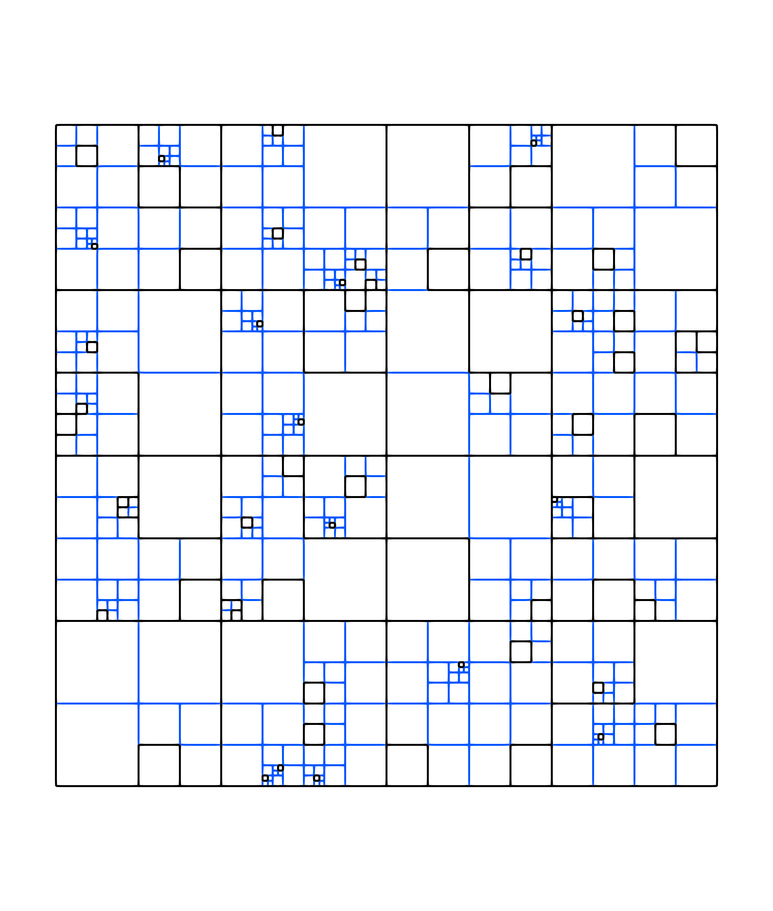
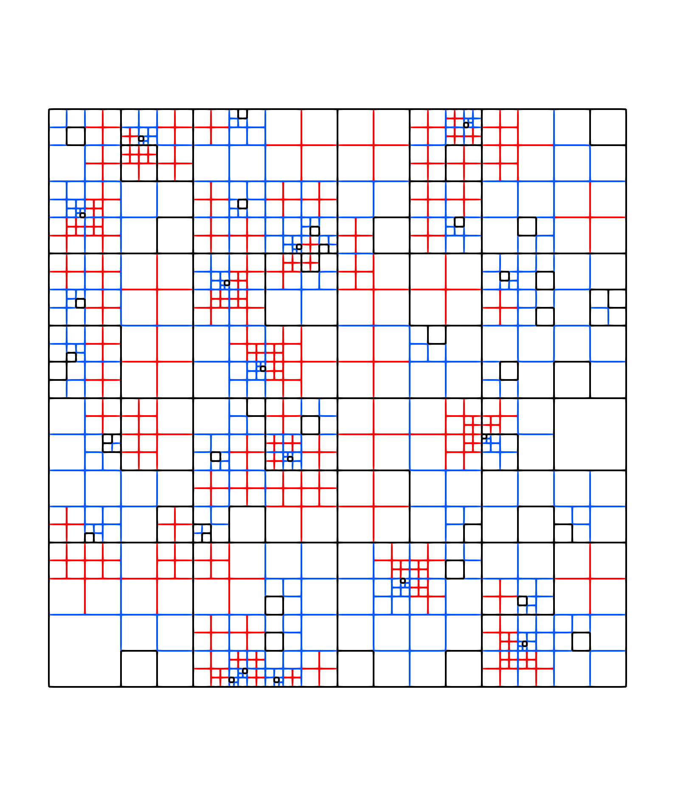

Graduation example: case 2
==========================

In this tutorial, the mesh is constituted of cells at different levels with overlaps and we want to end up with a graded mesh.
The complete example can be downloaded here: :download:`graduation case 2 <../../../demos/tutorial/graduation_case_2.cpp>`

First, we need an initial mesh with overlaps between levels.
We generate it randomly in the 2D domain :math:`[0, 1] \times [0, 1]`.
The idea is to add cells randomly at different levels.
The implementation of the initial mesh is described in the following code.

.. code-block:: c++

    auto generate_mesh(std::size_t min_level, std::size_t max_level, std::size_t nsamples = 100)
    {
        constexpr std::size_t dim = 2;

        samurai::CellList<dim> cl;
        cl[0][{0}].add_point(0);

        for(std::size_t s = 0; s < nsamples; ++s)
        {
            auto level = std::experimental::randint(min_level, max_level);
            auto x = std::experimental::randint(0, (1<<level) - 1);
            auto y = std::experimental::randint(0, (1<<level) - 1);

            cl[level][{y}].add_point(x);
        }

        return samurai::CellArray<dim>(cl, true);
    }

Let us explain the code step by step.
We use three parameters: `min_level` is the minimum level at which a cell can be added, `max_level` is the maximum level at which a cell can be added, and finally `nsamples` is the number of cells which are randomly added to the final mesh.

We first create a :cpp:class:`samurai::CellList` to add new cells (i.e. intervals) efficiently.
We first insert the cell `{0, 0}` at level `0` which corresponds to the square :math:`[0, 1] \times [0, 1]` to be sure that at the end we have the entire domain :math:`[0, 1] \times [0, 1]`.

.. code-block:: c++

    samurai::CellList<dim> cl;
    cl[0][{0}].add_point(0);

And then, we create randomly `nsamples` cells.

.. code-block:: c++

    for(std::size_t s = 0; s < nsamples; ++s)
    {
        auto level = std::experimental::randint(min_level, max_level);
        auto x = std::experimental::randint(0, (1<<level) - 1);
        auto y = std::experimental::randint(0, (1<<level) - 1);

        cl[level][{y}].add_point(x);
    }

Now, we can construct the :cpp:class:`samurai::CellArray` from this :cpp:class:`samurai::CellList` and give it back.

.. code-block:: c++

    return samurai::CellArray<dim>(cl, true);

The following figure is an example of such initial mesh with start_level = 1 and max_level = 7.

The next step is to remove any possible intersection between two levels.
We again utilize the subset mechanism of |project| as for the previous tutorial :doc:`graduation case 1 <./graduation_case_1>`.
The idea is the following: we make the intersection of the cells at a level `l` with that of the previous levels.
If this intersection is non-empty, then we refine the corresponding cells at the previous levels.
Then, we repeat this process until no intersection is detected.

For this algorithm, we use a field named `tag` linked to the mesh as in the previous case.
This field is an array of booleans. If a value is true, the corresponding cell must be refined. Otherwise, it must be kept.

The algorithm is similar to the algorithm described in :doc:`graduation case 1 <./graduation_case_1>`: only the subset definition is changed.

So, we try to find an intersection using subset construction between a level `level` and a `level_below` where `level_below < level`.

.. code-block:: c++

    auto set = samurai::intersection(ca[level], ca[level_below])
              .on(level_below);

    set([&](const auto& i, const auto& index)
    {
        tag(level_below, i, index[0]) = true;
    });

And we reconstruct a new mesh using `tag` and :cpp:class:`samurai::CellList` using the following algorithm.

.. code-block:: c++

    std::size_t min_level = ca.min_level();
    std::size_t max_level = ca.max_level();

    while(true)
    {
        auto tag = samurai::make_field<bool, 1>("tag", ca);
        tag.fill(false);

        for(std::size_t level = min_level + 1; level <= max_level; ++level)
        {
            for(std::size_t level_below = min_level; level_below < level; ++level_below)
            {
                auto set = samurai::intersection(ca[level], ca[level_below]).on(level_below);
                set([&](const auto& i, const auto& index)
                {
                    tag(level_below, i, index[0]) = true;
                });
            }
        }

        samurai::CellList<dim> cl;
        samurai::for_each_cell(ca, [&](auto cell)
        {
            auto i = cell.indices[0];
            auto j = cell.indices[1];
            if (tag[cell])
            {
                cl[cell.level + 1][{2*j}].add_interval({2*i, 2*i+2});
                cl[cell.level + 1][{2*j + 1}].add_interval({2*i, 2*i+2});
            }
            else
            {
                cl[cell.level][{j}].add_point(i);
            }
        });
        samurai::CellArray<dim> new_ca = cl;

        if(new_ca == ca)
        {
            break;
        }

        std::swap(ca, new_ca);
    }

The figure below depicts the initial mesh cleared from intersections.
The blue cells are the cells added in order to remove the intersections.

The graduation of this new mesh is straightforward since this is exactly the algorithm described in the previous case.
The figure below is the graded version of our initial mesh.
The red cells are those added by the graduation.

