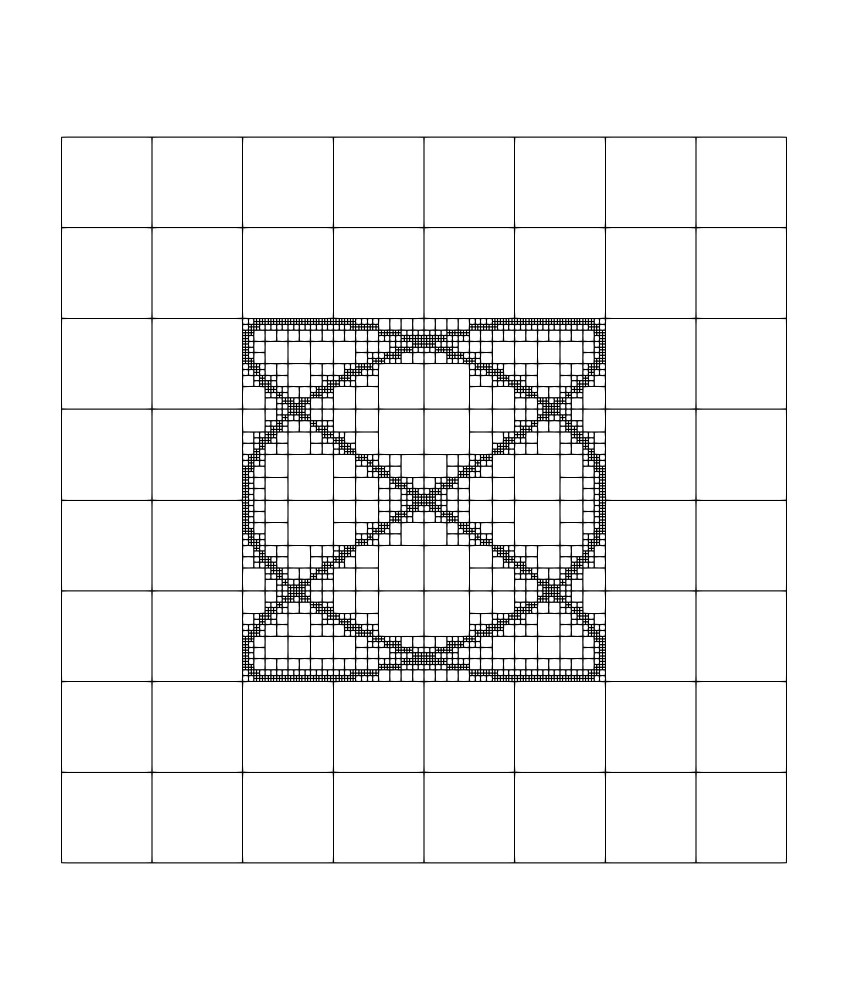
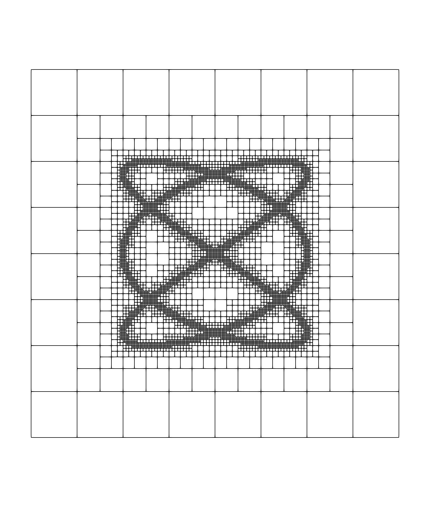

Graduation example: case 3
==========================

In this tutorial, the mesh we start from is already graded and a mesh adaptation algorithm is performed on it.
A tag array indicates which cells has to be refined or kept to build the new mesh.
We want to modify the tag array to ensure that the new mesh created from this object will be graded.
The complete example can be downloaded here: :download:`graduation case 3 <../../../demos/tutorial/graduation_case_3.cpp>`

We start from a mesh refined at a given level and use some criterion to tag a cell to refine it whenever the criterion is true.

The chosen criterion is: if one of the following points :math:`(x, y)` lies inside a given cell, then this cell has to be refined.

.. math::

    \begin{cases}
    x = \sin({at + \delta}) \\
    y = \sin({bt}   )
    \end{cases}
    \qquad \text{for} \quad t \in [0, 2 \pi].

For this example, we shall take :math:`a = 3`, :math:`b = 2` and :math:`\delta = \frac{\pi}{2}`.

Let us start by creating a mesh at level `start_level` for a 2D domain :math:`[-2, 2] \times [-2, 2]`.

.. code-block:: c++

    samurai::Box<int, dim> box({-2<<start_level, -2<<start_level},
                                {2<<start_level,  2<<start_level});
    samurai::CellArray<dim> ca;

    ca[start_level] = {start_level, box};

We first create a box of integers that contains the indices of the domain and then we create the `start_level` of the :cpp:class:`samurai::CellArray` from this box.

Now, we want to apply our criterion on this mesh to tag the cells to refine when the criterion is true.
We shall apply the `for_each_cell` function to this end.

We create a field named `tag` attached to the mesh.
Again, this field is an array of booleans.
If the value is set to true, the correspoding cell must be refined, otherwise, it must be kept .

.. code-block:: c++

    auto tag = samurai::make_field<bool, 1>("tag", ca);
    tag.fill(false);

We initialize all the entries of the field `tag` to `false` meaning that all the cells are potentially kept.
We apply the criterion on each cell.

.. code-block:: c++

    samurai::for_each_cell(ca, [&](auto cell)
    {
        auto corner = cell.corner();
        double dx = cell.length;

        std::size_t npoints = 1<<(max_level+4);
        double a = 3, b = 2, delta = M_PI*.5;
        double dt = 2.*M_PI/npoints;
        double t = 0;

        for(std::size_t it = 0; it < npoints; ++it)
        {
            double xc = std::sin(a*t + delta);
            double yc = std::sin(b*t);

            if ((corner[0] < xc) && (corner[0] + dx > xc) &&
                (corner[1] < yc) && (corner[1] + dx > yc))
            {
                tag[cell] = true;
                break;
            }
            t += dt;
        }
    });

The :cpp:func:`samurai::for_each_cell` function takes two parameters: the first one is the :cpp:class:`samurai::CellArray` defining the cells on which we want to apply the algorithm, the second one is a lambda function with a `cell` parameter.
This `cell` parameter is of type :cpp:class:`samurai::Cell`.
We use the method :cpp:func:`corner` to recover the bottom left point of each cell.

We have tagged the cells and we can now re-create a new mesh from the `tag` field by creating four new cells if the correspoding value is `true`.
We use :cpp:class:`samurai::CellList` to add new intervals efficiently.

.. code-block: c++

    samurai::CellList<dim> cl;
    samurai::for_each_interval(ca, [&](std::size_t level, const auto& interval, const auto& index)
    {
        auto j = index[0];
        for (int i = interval.start; i < interval.end; ++i)
        {
            if (tag[i + interval.index] && level < max_level)
            {
                cl[level + 1][{2*j}].add_interval({2*i, 2*i+2});
                cl[level + 1][{2*j + 1}].add_interval({2*i, 2*i+2});
            }
            else
            {
                cl[level][index].add_point(i);
            }
        }
    });

    samurai::CellArray<dim> new_ca = cl;

Until now, we have not paid attention to the graduation of the mesh even if the initial mesh was graded since it was made up by only one level.

The figure below gives the result with a start level set to 1 and a maximum level set to 6.
As we can observe, this mesh is not graded.

Thus, we have to add a step between the criteria and the creation of the new mesh from a :cpp:class:`samurai::CellList` to ensure the graduation.

Again, the idea is the following: we take the cells of a level `l` and we translate them in each direction with a stencil of width 1.
If the intersection with the cells at the level :math:`l - 1`  is non-empty and the cell at level `l` is tagged as to refine, then we have to tag the corresponding cells at level `l-1` to be refined as well.
We have to start from the largest level in order to "propagate" the tag correctly.

.. code-block:: c++

    xt::xtensor_fixed<int, xt::xshape<4, dim>> stencil{{1, 1}, {-1, -1}, {-1, 1}, {1, -1}};

    for (std::size_t level = ca.max_level(); level > 1; --level)
    {
        for(std::size_t i = 0; i < stencil.shape()[0]; ++i)
        {
            auto s = xt::view(stencil, i);
            auto subset = samurai::intersection(samurai::translate(ca[level], s), ca[level - 1]);

            subset([&](const auto& interval, const auto& index)
            {
                auto j_f = index[0];
                auto i_f = interval.even_elements();

                if (i_f.is_valid())
                {
                    auto mask = tag(level, i_f  - s[0], j_f - s[1]);
                    auto i_c = i_f >> 1;
                    auto j_c = j_f >> 1;
                    xt::masked_view(tag(level - 1, i_c, j_c), mask) = true;
                }

                i_f = interval.odd_elements();
                if (i_f.is_valid())
                {
                    auto mask = tag(level, i_f  - s[0], j_f - s[1]);
                    auto i_c = i_f >> 1;
                    auto j_c = j_f >> 1;
                    xt::masked_view(tag(level - 1, i_c, j_c), mask) = true;
                }
            });
        }
    }

The figure below shows the result of the graduation at the end of the refinement process.

