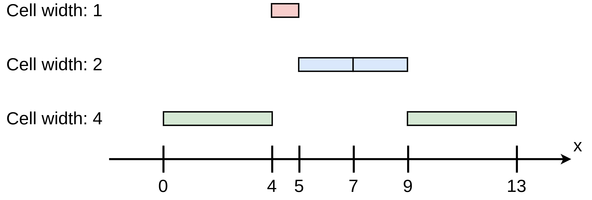
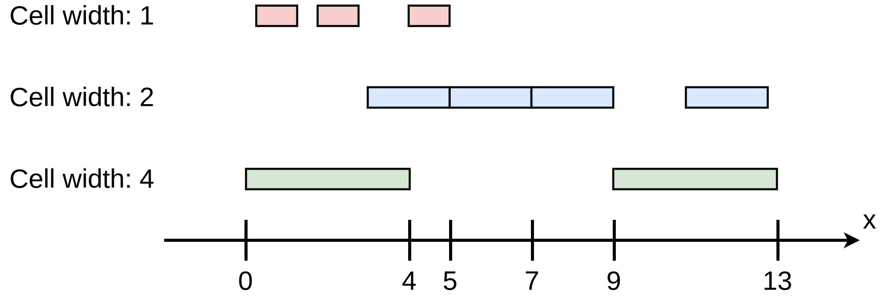
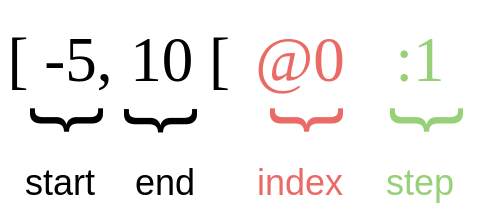
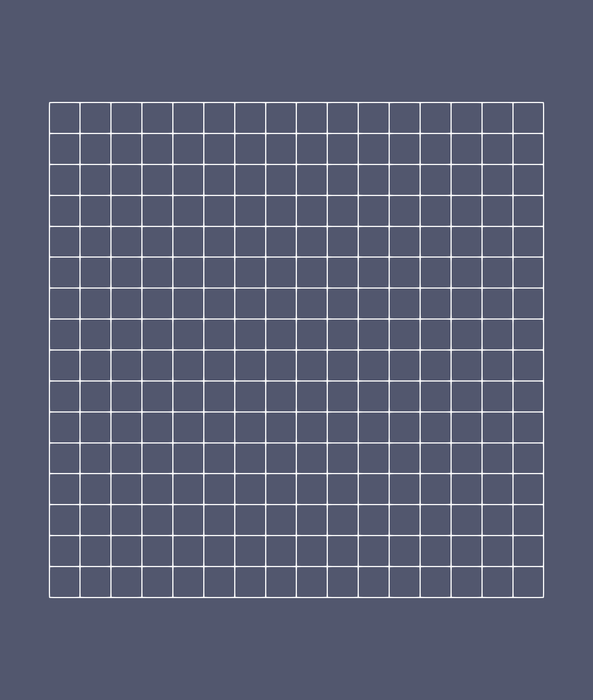

Interval and cartesian grid representation
==========================================

Introduction
------------

A cartesian grid is composed of several cells with a given edge length.
The length can be the same for all the cells such as in the case of uniform grids.
The core idea in |project| is that a cartesian grid can be represented by intervals.
To illustrate this purpose, we start with a simple 1D example.
Consider

.. image:: ./figures/segments.png
    :width: 80%
    :align: center

The whole domain is defined by the interval :math:`[0, 13]`.
It is made up of five cells which can also be interpreted as intervals (visiting the domain from left to right)

- cell 1: :math:`[0, 4]` (green)
- cell 2: :math:`[4, 5]` (red)
- cell 3: :math:`[5, 7]` (blue)
- cell 4: :math:`[7, 9]` (blue)
- cell 5: :math:`[9, 13]` (green)

In this example, we also observe that several cells have the same width, so they can be collected in families of equal width (or resolution)

- width of size 1: :math:`[4, 5]`
- width of size 2: :math:`[5, 9]`
- width of size 4: :math:`[0, 4]`, :math:`[9, 13]`

Since we know the resolution, we can regroup the cells to construct contiguous intervals, still being able to "crop" as the were unmerged.
Indeed, in the class of cells of width 2, we have two contiguous cells: :math:`[5, 7]` and :math:`[7, 9]` which form the interval :math:`[5, 9]`.
Therefore, since we know the resolution of this given interval, the two cells can be reconstructed.

If we plot the mesh over the initial domain using different levels of resolution, we obtain

In this example, we have chosen not to have intersections between cells at different levels.
Still, this is not mandatory and we can imagine a mesh with overlapping regions on a given domain

.. note::

    It is worthwhile observing that the construction of the cells in |project| still has some constraints and it will not be possible to exactly construct the previously described domain.
    These constraints shall be explained in the next section.

Interval definition
-------------------

The data structure widely used by |project| is the interval.
An interval is described as follows

An interval is defined by its start and end values (left and right extrema values, in black).
Moreover, we introduce two additional attributes

- the index (in red), which is used to make the link (being an offset) with the actual structure where data are stored (more details in the sequel).
- the step (in green), which represents the step utilized to navigate inside the interval it refers to.

.. warning::

    - In the previous introduction, we have not paid attention to the type of extrema values describing the interval. In |project|, the start and the end of the interval are integers.

    - It is also important to notice that the end value of the interval is not included. Intervals are closed on the left and open on the right.

As in the introduction, we can handle multiple resolutions, which mean different cell sizes.
The grid resolution is indexed and defined by a level.
Thus, the size of a cell (edge length) is fixed by its level in the following way

.. math:: \Delta x = \frac{1}{2^{level}}.
    :label: dx

At this stage of development, we take the size to be the same in all the directions, and, therefore, the cells are squares in 2D and cubes in 3D.

As emphasized in the previous remark, in |project|, intervals are represented by integers instead that by real numbers as in the introduction.
This is made possible by the fact that an interval is associated to some cells at a given level, whose size (a real number) can be simply obtained by :eq:`dx`.
The figure below illustrates the idea

We have two cells :math:`0` and :math:`1` on the level :math:`l`. Therefore, we can write that the interval :math:`[0, 2[` describes this domain at the level :math:`l`.

.. note::

    We could have chosen to describe closed intervals such as :math:`[0, 1]`. Nevertheless, the fact of excluding the end of the interval has important consequences for the algebra of intervals (see :ref:`AlgebraOfSet`).

.. _cell:

Cell properties
---------------

As hinted so far, given an interval and a level, we can reconstruct the correspoding cells.
Indeed:

- The number of cells contained in an interval is equal to the size of the interval.
- The size of an interval is given by

.. math::
    size = end - start.

- The coordinates of the "minimal" corner (left in 1D, lower-left in 2D, lower-lower-left in 3D) of a cell is given by

.. math::

    corner = (i \Delta x, j \Delta x, ...)

where :math:`\Delta x` is given by equation :eq:`dx`.

- The coordinates of the center of a cell is given by

.. math::

    center = \left(\left(i + \frac{1}{2}\right) \Delta x, \left(j + \frac{1}{2}\right) \Delta x, ...\right).

Constraints on the grid representation
--------------------------------------

As stressed before, there are some constraints on the grid representation allowed by |project|.

Since the extrema values for each interval (and thus the cells) are constrained to be integers and the corresponding real coordinates are reconstructed from these values via :math:`\Delta x`, the latter will take only certain values following this principle.
Therefore, not every real coordinate can be represented by this system.

Suppose we are considering level 1 with associated step :math:`\Delta x = 0.5` for a 1D problem.
It is therefore impossible by definition to have a cell at this level with center at :math:`\frac{1}{3}`.

.. note::

    Of course, we can imagine that in the future versions of |project|, we could have some operator which transforming the grid represented by intervals onto cells of the real domain.

The remaining constraint is that a cell at the level :math:`l` is included in a cell at a lower level.

.. image:: ./figures/interval-3.png
    :width: 80%
    :align: center

.. note::

    This property is important to perform mesh adaptation.

1D mesh example
---------------

Let us now consider a 1D example with several levels and explain how the mesh is stored in |project|.

.. image:: ./figures/interval_example_1D.png
    :width: 80%
    :align: center

For each level, the intervals are

- level 0: :math:`[0, 2[`, :math:`[5, 6[`
- level 1: :math:`[4, 7[`, :math:`[8, 10[`
- level 2: :math:`[14, 16[`

The actual(real) intervals are given by the level and :math:`\Delta x` defined by :eq:`dx`, thus yielding

- level 0: :math:`[0., 2.]`, :math:`[5., 6.]`
- level 1: :math:`[2., 3.5]`, :math:`[4., 5.]`
- level 2: :math:`[3.5, 4.]`

.. note::

    There are no overlapping regions in this example.
    The purpose is to make the example more understandable.
    Still, we shall see examples with overlaps in the following tutorials.
    Indeed, this latter case often happens when mesh adaptation is performed and ghost cells are needed to update the solution using a spatial operator with a stencil (such fluxes for Finite Volumes discretizations).

The following code implements this example using |project|.

.. literalinclude:: snippet/interval.cpp
  :language: c++

The associated output is

.. literalinclude:: snippet/interval_output.txt

The computation of the index values represented by the `@` operator will be explained in a next section.

Two new data structures are used in this example :cpp:class:`samurai::CellList` and :cpp:class:`samurai::CellArray` which are C++ arrays of size `max_level` defined as a template parameter.
The default size is 16.

:cpp:class:`samurai::CellList` is used to efficiently add new intervals when the mesh is constructed.
As its name suggests, :cpp:class:`samurai::CellList` is nothing else than a list of intervals in the x-direction.
This list is stored in a map where the keys are the indices in the other dimensions (y, z, ...) and the values are the list of intervals in the x-direction.

.. note::

    We will give an example of a 2D case to better explain how the keys are constructed.
    For 1D problems, the key obviously remains empty.
    This is why we use :cpp_code:`{}` in the construction of the :cpp:class:`samurai::CellList` like in :cpp_code:`cl[0][{}].add_interval({ 0,  2});`

Indeed, the :cpp:class:`samurai::CellList` data structure is efficient at adding new elements (search, removal and insertion operations have logarithmic complexity for :cpp_code:`std::map`).
On the other hand, when scientific computing algorithms, such as numerical schemes, come, it is crucial to efficiently loop over the cells without a search algorithm.
Moreover, we also want to apply algebraic operations on sets of intervals for a given dimension which means that a dimension should have its own representation by intervals in a compact writing.

To this end :cpp:class:`samurai::CellArray` is precisely used to compress the representation of the mesh, obtain that each spatial dimension has its own interval list stored as an array.

In our 1D example, the :cpp:class:`samurai::CellList` associated with this mesh is

.. code::

    level 0:
        x: [0, 2[, [5, 6[

    level 1:
        x: [4, 7[, [8, 10[

    level 2:
        x: [14, 16[

and the :cpp:class:`samurai::CellArray` is defined in the same fashion.
The only difference is that `x` is a :cpp_code:`std::forward_list` of :cpp:class:`samurai::Interval` in :cpp:class:`samurai::CellList` and a :cpp_code:`std::vector` of :cpp:class:`samurai::Interval` in :cpp:class:`samurai::CellArray`.

To understand the differences, we must address an example in 2D.

2D mesh example
---------------

The example below is supposed to help the reader to better understand the subtle difference between :cpp:class:`samurai::CellList` and :cpp:class:`samurai::CellArray`.
Consider the following mesh

.. image:: ./figures/2D_mesh.png
    :width: 60%
    :align: center

The :cpp:class:`samurai::CellList` associated with this mesh is

.. code::

    level 0:
        y: 0
            x: [0, 4[
        y: 1
            x: [0, 1[, [3, 4[
        y: 2
            x: [0, 1[, [3, 4[
        y: 3
            x: [0, 3[

    level 1:
        y: 2
            x: [2, 6[
        y: 3
            x: [2, 6[
        y: 4
            x: [2, 4[, [5, 6[
        y: 5
            x: [2, 6[
        y: 6
            x: [6, 8[
        y: 7
            x: [6, 7[

    level 2:
        y: 8
            x: [8, 10[
        y: 9
            x: [8, 10[
        y: 14
            x: [14, 16[
        y: 15
            x: [14, 16[

The key of the map in :cpp:class:`samurai::CellList` is the index in `y` and the value of the key is the list of intervals in the x-direction for this key (index).

On the other hand, the :cpp:class:`samurai::CellArray` is

.. code::

    level 0:
        x: [0, 4[, [0, 1[, [3, 4[, [0, 1[, [3, 4[, [0, 3[
        y: [0, 4[@0
        y-offset: [0, 1, 3, 5, 6]

    level 1:
        x: [2, 6[, [2, 6[, [2, 4[, [5, 6[, [2, 6[, [6, 8[, [6, 7[
        y: [2, 8[@-2
        y-offset: [0, 1, 3, 5, 6, 7, 8]

    level 2:
        x: [8, 10[, [8, 10[, [14, 16[, [14, 16[
        y: [8, 10[@-8, [14, 16[@-12
        y-offset: [0, 1, 2, 3, 4]

How do we construct a :cpp:class:`samurai::CellArray` from a :cpp:class:`samurai::CellList`?

First, we concatenate the intervals met in the x-direction for each index `y` at a given level.
Therefore, the x array at level 2 representing the intervals in the x-direction is

.. code::

    x: [8, 10[, [8, 10[, [14, 16[, [14, 16[

Then, we try to construct intervals in the y-direction from the keys. For level 2, we have the keys `y = 8, 9, 14, 15`.
Therefore, we can construct two intervals with consecutive elements: :math:`[8, 10[` and :math:`[14, 16[`.

The compressed view of the :cpp:class:`samurai::CellList` at level 2 is as follows

.. code::

    x: [8, 10[, [8, 10[, [14, 16[, [14, 16[
    y: [8, 10[, [14, 16[

Now, we have to connect each `y` entry to the corresponding intervals in the x-direction. To this end we utilize a new array called `y-offset` and the index of the `y` interval represented by the operator `@`.

Each y has one corresponding interval in the x-direction. The `y-offset` indicates for each y where are the corresponding intervals in the x-direction inside the array x.

- for `y = 8`, there is one interval in x-direction,
- for `y = 9`, there is one interval in x-direction,
- for `y = 14`, there is one interval in x-direction,
- for `y = 15`, there is one interval in x-direction.

Thus the `y-offset` is the array `[0, 1, 2, 3, 4]`. The size of this array is the number of y + 1 and indicates that :math:`y[i]` corresponds to the intervals in the x-direction between :math:`y-offset[i]` and :math:`y-offset[i+1]` in the x array.

One point still has to be clarified: how many elements y have we already gone through to know where to look in the `y-offsets`?
This is where the index comes into play.
If we look at the y interval :math:`[14, 16[`, we know that the corresponding index in `y-offsets` for `y = 14` is `y-offset[2]`.
To obtain the right index, we choose the index defined in the interval by the `@` operator in order to have `y + index` is equal to the entry in the `y-offset` entry.
Then for `y = 14`, if the index is equal to `-12`, we find `y-offset[y + @index] = y-offset[14 - 12] = y-offset[2]`.

If the same operation is made to compute the `y-offset` and the index on each interval in the y-direction, we end up the corresponding :cpp:class:`samurai::CellArray`.

.. code::

    level 0:
        x: [0, 4[, [0, 1[, [3, 4[, [0, 1[, [3, 4[, [0, 3[
        y: [0, 4[@0
        y-offset: [0, 1, 3, 5, 6]

    level 1:
        x: [2, 6[, [2, 6[, [2, 4[, [5, 6[, [2, 6[, [6, 8[, [6, 7[
        y: [2, 8[@-2
        y-offset: [0, 1, 2, 4, 5, 6, 7]

    level 2:
        x: [8, 10[, [8, 10[, [14, 16[, [14, 16[
        y: [8, 10[@-8, [14, 16[@-12
        y-offset: [0, 1, 2, 3, 4]

.. note::

    The algorithm described here to compress the :cpp:class:`samurai::CellList` to yield the :cpp:class:`samurai::CellArray` for the 2D is a recursive algorithm and, thus, it can be easily used for other spatial dimensions.
    Therefore, we are not obliged to stick with 1D, 2D, and 3D problems: we can construct a grid in higher dimensions.

The implementation of this example is

.. literalinclude:: snippet/2d_mesh_representation.cpp
  :language: c++

And the output is

.. literalinclude:: snippet/2d_mesh_representation_output.txt

Build a grid from a box
-----------------------

Since the beginning, we have used :cpp:class:`samurai::CellList` to build :cpp:class:`samurai::CellArray`.
Now we show that we can also easily initialize a :cpp:class:`samurai::CellArray` at a given level with a uniform cartesian grid by defining a box.

- The box can be 1D, 2D, or 3D.
- The box can either define the cells involved in the grid using integers or in real coordinates.

The following example uses a box in real coordinates

.. literalinclude:: snippet/2d_mesh_box.cpp
  :language: c++

The box is defined by its "minimal" (lower-left in 2D) and "maximal" (upper-right in 2d) corners.
In this example, the box is therefore :math:`[-1, 1] \times [-1, 1]`.
The space step is chosen from the given level which means :math:`\Delta x = 2^{-3} = 0.125`. The number of cells is defined by the length of the box and the space step.

.. literalinclude:: snippet/2d_mesh_box_output.txt

We obtain the following mesh

.. warning::

    Since the size of the cells is fixed at a given level and their coordinates are constrained by their integer representation, it is not always possible to build a box in real coordinates where the bounds of the box correspond to a corner point of a cell.
