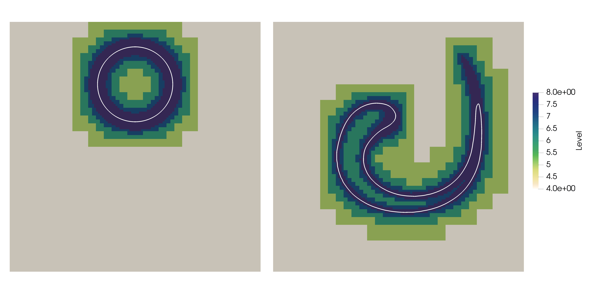

Example Level-set
==========================================

A given contour :math:`\Gamma(t)` can be represented as the zero-level of a scalar function :math:`\phi(t, \mathbf{x})`, called level-set function

.. math::

    \Gamma(t) = \left \{ \mathbf{x} \quad : \quad \phi(t, \mathbf{x}) = 0 \right \}.
.. math::

It can be shown \cite{osher2004level} that the outward normal vector :math:`\mathbf{n}` and the mean curvature :math:`\kappa` are recovered by differentiation using

.. math::
    \mathbf{n} = \dfrac{\nabla \phi}{\left | \nabla \phi \right |}, \qquad \kappa = \nabla \cdot \mathbf{n} = \nabla \cdot \left (\dfrac{\nabla \phi}{\left | \nabla \phi \right |} \right ).

We consider a level-set function :math:`\phi: \mathbb{R} \times \mathbb{R}^2 \to \mathbb{R}` which evolves according to the passive transport equation (also known as "color equation") given by

.. math::
    \partial_t \phi + \mathbf{u} \cdot \nabla \phi = 0,

where :math:`\mathbf{u} = (u, v)` is a velocity field which is supposed to be everywhere divergence-free. We remark that both :math:`\phi` and :math:`\mathbf{u}` are known only on the leaves of the discretized tree representing the numerical mesh.

The previous equation is discretized by the following Finite-Volume scheme

.. math::
    \phi_{j, k, h}^{n+1} = \phi_{j, k, h}^{n} + \frac{\Delta t}{\Delta x_j} \left ( F_{j, k-1/2, h}^n- F_{j, k+1/2, h}^n + F_{j, k, h-1/2}^n- F_{j, k, h-1/2}^n\right ).

In terms of C++ code, this reads

.. code-block:: c++

    update_ghosts(phi, u, update_bc_for_level);
    auto phinp1 = samurai::make_field<double, 1>("phi", mesh);
    phinp1 = phi - dt * samurai::upwind_variable(u, phi, dt);

where the sum of the fluxes through each boundary is defined by

.. code-block:: c++

    template<class D>
    class finite_volume : public field_expression<D> {
      public:
        using derived_type = D;

        derived_type &derived_cast() & noexcept;
        const derived_type &derived_cast() const &noexcept;
        derived_type derived_cast() && noexcept;

        template<class... CT>
        inline auto operator()(Dim<2> d, CT &&... e) const
        {
            return (-derived_cast().left_flux(std::forward<CT>(e)...) +
                    derived_cast().right_flux(std::forward<CT>(e)...) +
                    -derived_cast().down_flux(std::forward<CT>(e)...) +
                    derived_cast().up_flux(std::forward<CT>(e)...))/derived_cast().dx();
        }

      protected:
        finite_volume(){};
        ~finite_volume() = default;

        finite_volume(const finite_volume &) = default;
        finite_volume &operator=(const finite_volume &) = default;

        finite_volume(finite_volume &&) = default;
        finite_volume &operator=(finite_volume &&) = default;
    };

We provide the example of the left flux for the :math:`x`-axis. It is given by the Lax-Wendroff limited flux with limiting function :math:`\psi: \mathbb{R} \to [0, 2]`

.. math::
     F_{j, k-1/2, h}^n &= \left ( u_{j, k-1/2, h}^n \right )^- \phi_{j, k, h}^n + \left ( u_{j, k-1/2, h}^n \right )^+ \phi_{j, k-1, h}^n \\
     &+ \frac{1}{2} \left | u_{j, k-1/2, h}^n \right | \left (1 - \left | u_{j, k-1/2, h}^n \right | \frac{\Delta t}{\Delta x_j} \right ) \psi \left ( \theta_{j, k-1/2, h}^n  \right ) \left (\phi_{j, k, h}^n - \phi_{j, k-1, h}^n \right ),

from \cite{leveque2002} (see (6.32) at page 113), where we have the positive part :math:`a^+ := \max{(0, a)}` and the negative part :math:`a^- := \min{(0, a)}`. We take the MR limiter introduced by Van Leer \cite{van1977}

.. math::
    \psi(\theta) = \max{(0, \min{(2\theta, (1+\theta)/2, 2)})},

and following (6.36) in \cite{leveque2002}

.. math::
    \theta_{j, k-1/2, h}^n = \begin{cases}
                                    \dfrac{\phi_{j, k-1, h}^n - \phi_{j, k, h}^n}{\phi_{j, k, h}^n - \phi_{j, k-1, h}^n}, \qquad \text{if} \quad & u_{j, k-1/2, h}^n > 0,\\
                                    \dfrac{\phi_{j, k+1, h}^n - \phi_{j, k, h}^n}{\phi_{j, k, h}^n - \phi_{j, k-1, h}^n}, \qquad \text{if} \quad & u_{j, k-1/2, h}^n < 0.
                             \end{cases}

The first component of the velocity has been reconstructed at the interface using the second-order formula

.. math::
    u_{j, k-1/2, h}^n = \frac{3}{8}u_{j, k-1, h}^n + \frac{3}{4}u_{j, k, h}^n - \frac{1}{8} u_{j, k+1, h}.

It is worthwhile observing that we cannot expect  our FV strategy to be formally second-order accurate in the case of non-uniform velocity field :math:`\mathbf{u}` as pointed out by \cite{leveque2002} at page 163.

Translated into C++ code, we have

.. code-block:: c++

    template<class TInterval>
    class upwind_variable_op : public field_operator_base<TInterval>,
                           public finite_volume<upwind_variable_op<TInterval>> {
      public:
        INIT_OPERATOR(upwind_variable_op)

        template<class T0, class T1, class T2, class T3>
        inline auto flux(T0 && vel, T1&& ul, T2&& ur, double lb, T3 && r) const
        {

            auto mc = 
            {
                return xt::maximum(0., xt::minimum(xt::minimum(2.*y, .5*(1.+y)), 2.));
            };

            auto pos_part = [] (auto & a)
            {
                return xt::maximum(0, a);
            };

            auto neg_part = 
            {
                return xt::minimum(0, a);
            };

            return xt::eval((neg_part(std::forward<T0>(vel))*std::forward<T2>(ur)  // Upwind part
                           + pos_part(std::forward<T0>(vel))*std::forward<T1>(ul)) // of the flux
                           + 0.5 * mc(std::forward<T3>(r))*xt::abs(std::forward<T0>(vel))
                                                *(1.-lb*xt::abs(std::forward<T0>(vel)))
                                                *(std::forward<T2>(ur)-std::forward<T1>(ul)));
        }

        // 2D
        template<class T0, class T1>
        inline auto left_flux(const T0 & vel, const T1 &u, double dt) const
        {
            auto vel_at_interface =xt::eval( 3./8 * vel(0, level, i-1, j)
                                            +3./4 * vel(0, level, i  , j)
                                            -1./8 * vel(0, level, i+1, j));

            auto denom = xt::eval(u(level, i, j)-u(level, i-1, j));
            auto mask = xt::abs(denom) < 1.e-8;
            xt::masked_view(denom, mask) = 1.e-8;

            xt::xtensor<bool, 1> mask_sign = vel_at_interface >= 0.;

            auto rm12 = xt::eval(1. / denom);
            xt::masked_view(rm12, mask_sign)  = rm12 * (u(level, i-1, j)-u(level, i-2, j));
            xt::masked_view(rm12, !mask_sign) = rm12 * (u(level, i+1, j)-u(level, i  , j));

            return flux(vel_at_interface, u(level, i-1, j), u(level, i, j), dt/dx(), rm12);
        }

        template<class T0, class T1>
        inline auto right_flux(const T0 & vel, const T1 &u, double dt) const
        {
            // ...
        }

        // ...
    };

    template<class... CT>
    inline auto upwind_variable(CT &&... e)
    {
        return make_field_operator_function<upwind_variable_op>(std::forward<CT>(e)...);
    }

At each time-step :math:`t^n`, it is customary \cite{gibou2018} to reinitialize the level set :math:`\phi(t^n)` to be a signed distance function by solving the eikonal equation

.. math::
    \begin{cases}
        \partial_{\tau} \phi + \text{sign}(\phi(t^n)) \left (|\nabla \phi| - 1 \right ) = 0, \\
        \phi(\tau = 0) \equiv \phi(t^n),
    \end{cases}

with fictitious time :math:`\tau` until reaching the steady state.

Traditionally one employs a semi-discretization using the Godunov Hamiltonian

.. math::
    H(a,b,c,d) = \text{sign}(\phi(t^n)) \begin{cases}
                                            \sqrt{\max{(|a^+|^2, |b^-|^2)} + \max{(|c^+|^2, |d^-|^2)}} - 1, \qquad \text{if} \quad &\text{sign}(\phi(t^n)) \geq 0, \\
                                            \sqrt{\max{(|a^-|^2, |b^+|^2)} + \max{(|c^-|^2, |d^+|^2)}} - 1, \qquad \text{if} \quad &\text{sign}(\phi(t^n)) < 0,
                                        \end{cases}

with a time stepping achieved by a TVD Runge Kutta scheme. In our case, we take a TVD-RK2 scheme which reads:

.. math::
    \overline{\phi}_{j, k, h}^{\eta + 1} &=  \phi_{j, k, h}^{\eta} - \Delta \tau H(\partial_x^+ \phi_{j, k, h}^{\eta}, \partial_x^- \phi_{j, k, h}^{\eta}, \partial_y^+ \phi_{j, k, h}^{\eta}, \partial_y^- \phi_{j, k, h}^{\eta}), \\
    \overline{\overline{\phi}}_{j, k, h}^{\eta + 1} &=  \overline{\phi}_{j, k, h}^{\eta} - \Delta \tau H(\partial_x^+ \overline{\phi}_{j, k, h}^{\eta}, \partial_x^- \overline{\phi}_{j, k, h}^{\eta}, \partial_y^+ \overline{\phi}_{j, k, h}^{\eta}, \partial_y^- \overline{\phi}_{j, k, h}^{\eta}),\\
    \phi_{j, k, h}^{\eta + 1} &= \dfrac{1}{2} \phi_{j, k, h}^{\eta} + \dfrac{1}{2} \overline{\overline{\phi}}_{j, k, h}^{\eta + 1},

where :math:`\partial_x^{\pm} \phi` and :math:`\partial_y^{\pm} \phi` are one-sided discretizations of the partial derivatives obtained by WENO discretizations.
In our implementation, we keep things simple and the use of

.. math::
    \partial_x^{\pm} \phi_{j, k, h} = \frac{1}{\Delta x_j} \left (\mp \frac{1}{2} \phi_{j, k\pm 2, h}  \pm 2 \phi_{j, k \pm 1, h} \mp \frac{3}{2} \phi_{j, k, h} \right ).

In C++, the time stepping for such a scheme is

.. code-block:: c++

    auto phi_0 = phi;
    for (std::size_t k = 0; k < fict_iteration; ++k)
    {
        // TVD-RK2
        update_ghosts(phi, u, update_bc_for_level);
        auto phihat = samurai::make_field<double, 1>("phi", mesh);
        phihat = phi - dt_fict * H_wrap(phi, phi_0, max_level);

        update_ghosts(phihat, u, update_bc_for_level); // Crucial !!!
        phinp1 = .5 * phi_0 + .5 * (phihat - dt_fict * H_wrap(phihat, phi_0, max_level));
        std::swap(phi.array(), phinp1.array());
    }

where the Hamiltonian flux is encoded by

.. code-block:: c++

    template<class TInterval>
    class H_wrap_op : public field_operator_base<TInterval>,
                      public field_expression<H_wrap_op<TInterval>>
    {
    public:
        INIT_OPERATOR(H_wrap_op)

        template<class Field>
        inline auto operator()(Dim<2> d, const Field& phi, const Field& phi_0, const std::size_t max_level) const
        {
            double dx = this->dx();
            auto out = xt::empty<double>({i.size()});
            out.fill(0.);

            if (level == max_level){
                // // Second-order one sided
                auto dxp = 1./dx * ( .5*phi(level, i-2, j)-2. *phi(level, i-1, j)
                                                          +1.5*phi(level, i, j));

                auto dxm = 1./dx * (-.5*phi(level, i+2, j)+2. *phi(level, i+1, j)
                                                          -1.5*phi(level, i, j));

                auto dyp = 1./dx * ( .5*phi(level, i, j-2)-2. *phi(level, i, j-1)
                                                          +1.5*phi(level, i, j));

                auto dym = 1./dx * (-.5*phi(level, i, j+2)+2. *phi(level, i, j+1)
                                                          -1.5*phi(level, i, j));

                auto pos_part = [] (auto & a)
                {
                    return xt::maximum(0., a);
                };

                auto neg_part = 
                {
                    return xt::minimum(0., a);
                };

                xt::xtensor<bool, 1> mask = xt::sign(phi_0(level, i, j)) >= 0.;

                xt::masked_view(out, mask) = xt::sqrt(xt::maximum(xt::pow(pos_part(dxp), 2.),
                                                                  xt::pow(neg_part(dxm), 2.))
                                                     +xt::maximum(xt::pow(pos_part(dyp), 2.),
                                                                  xt::pow(neg_part(dym), 2.)))
                                             -1.;

                xt::masked_view(out, !mask) = -(xt::sqrt(xt::maximum(xt::pow(neg_part(dxp), 2.),
                                                                     xt::pow(pos_part(dxm), 2.))
                                                        +xt::maximum(xt::pow(neg_part(dyp), 2.),
                                                                     xt::pow(pos_part(dym), 2.)))
                                                -1.);

            }

            return xt::eval(out);
        }
    };

    template<class... CT>
    inline auto H_wrap(CT &&... e)
    {
        return make_field_operator_function<H_wrap_op>(std::forward<CT>(e)...);
    }

We utilize the AMR mesh adaptation based on the following criterion directly inspired by \cite{min2007, gibou2018, theillard2019} and \cite{bellotti2019}

.. math::
    \text{Split} \quad C_{j, k, h} \quad \text{if} \quad \left | \phi_{j, k, h} \right | \leq \text{Lip}(\phi) ~ M ~\sqrt{2} \Delta x_j,

where :math:`M \in \mathbb{N}` (we take :math:`M = 5`) and :math:`\text{Lip}(\phi)` is the Lipschitz constant of the level-set (we take :math:`\text{Lip}(\phi) = 1.2`).

At each time step, the mesh is updated using

.. code-block:: c++

    while(true)
    {
        auto tag = samurai::make_field<int, 1>("tag", mesh);
        AMR_criteria(phi, tag);

        make_graduation(tag);

        update_ghosts(phi, u, update_bc_for_level);

        if(update_mesh(phi, u, tag))
        {
            break;
        }
    }

The criterion provides the following set of flags

.. code-block:: c++

    template<class Field, class Tag>
    void AMR_criteria(const Field& f, Tag& tag)
    {
        auto mesh = f.mesh();
        std::size_t min_level = mesh.min_level();
        std::size_t max_level = mesh.max_level();

        samurai::for_each_cell(mesh[SimpleID::cells], [&](auto cell)
        {

            double dx = 1./(1 << (max_level));

            if (std::abs(f[cell]) < 1.2 * 5 * std::sqrt(2.) * dx)
            {
                tag[cell] = (cell.level == max_level) ? static_cast<int>(samurai::CellFlag::keep)
                                                      : static_cast<int>(samurai::CellFlag::refine);
            }
            else
            {
                tag[cell] = (cell.level == min_level) ? static_cast<int>(samurai::CellFlag::keep)
                                                      : static_cast<int>(samurai::CellFlag::coarsen);
            }
        });
    }

Then make_graduation(tag) graduates the corresponding tree and the mesh update is performed projecting the averages onto the father cell when the sons are eliminated and predicting the values using interpolations when four new cells are created

.. code-block:: c++

    template<class Field, class Field_u, class Tag>
    bool update_mesh(Field& f, Field_u& u, const Tag& tag)
    {
        using mesh_t = typename Field::mesh_t;
        using interval_t = typename mesh_t::interval_t;
        using coord_index_t = typename interval_t::coord_index_t;
        using cl_type = typename mesh_t::cl_type;

        auto mesh = f.mesh();

        cl_type cell_list;

        samurai::for_each_interval(mesh[SimpleID::cells], [&](std::size_t level, const auto& interval, const auto& index_yz)
        {
            for (int i = interval.start; i < interval.end; ++i)
            {
                if (tag[i + interval.index] & static_cast<int>(samurai::CellFlag::refine))
                {
                    samurai::static_nested_loop<dim - 1, 0, 2>([&](auto stencil)
                    {
                        auto index = 2 * index_yz + stencil;
                        cell_list[level + 1][index].add_interval({2 * i, 2 * i + 2});
                    });
                }
                else if (tag[i + interval.index] & static_cast<int>(samurai::CellFlag::keep))
                {
                    cell_list[level][index_yz].add_point(i);
                }
                else
                {
                    cell_list[level-1][index_yz>>1].add_point(i>>1);
                }
            }
        });

        mesh_t new_mesh(cell_list, mesh.min_level(), mesh.max_level());

        if (new_mesh == mesh)
        {
            return true;
        }

        Field new_f{f.name(), new_mesh};
        new_f.fill(0.);

        Field_u new_u{u.name(), new_mesh};
        new_u.fill(0.);

        for (std::size_t level = mesh.min_level(); level <= mesh.max_level(); ++level)
        {
            auto subset = samurai::intersection(mesh[SimpleID::cells][level],
                                         new_mesh[SimpleID::cells][level]);

            subset.apply_op(samurai::copy(new_f, f));
            subset.apply_op(samurai::copy(new_u, u));
        }

        samurai::for_each_interval(mesh[SimpleID::cells], [&](std::size_t level, const auto& interval, const auto& index_yz)
        {
            for (coord_index_t i = interval.start; i < interval.end; ++i)
            {
                if (tag[i + interval.index] & static_cast<int>(samurai::CellFlag::refine))
                {
                    samurai::compute_prediction(level, interval_t{i, i + 1}, index_yz, f, new_f);
                    samurai::compute_prediction(level, interval_t{i, i + 1}, index_yz, u, new_u);
                }
            }
        });

        for (std::size_t level = mesh.min_level() + 1; level <= mesh.max_level(); ++level)
        {
            auto subset = samurai::intersection(mesh[SimpleID::cells][level],
                                         new_mesh[SimpleID::cells][level - 1])
                          .on(level - 1);
            subset.apply_op(projection(new_f, f));
            subset.apply_op(projection(new_u, u));
        }

        f.mesh_ptr()->swap(new_mesh);
        std::swap(f.array(), new_f.array());
        std::swap(u.array(), new_u.array());

        return false;
    }

For the test, we consider the computational domain :math:`\Omega = [0, 1]^2` and a divergence-free velocity field

.. math::
    \mathbf{u} = \left ( -\sin^2{(\pi x)}\sin{(2\pi y)}, \sin^2{(\pi y)}\sin{(2\pi x)} \right ),

and the initial shape of the contour given by

.. math::
    \phi(x, y) = \sqrt{(x-1/2)^2 + (y-3/4)^2} - 3/20.

Just to show how to initialize the velocity field, we consider the following C++ code

.. code-block:: c++

    template <class Mesh>
    auto init_velocity(Mesh &mesh)
    {
        using mesh_id_t = typename Mesh::mesh_id_t;

        auto u = samurai::make_field<double, 2>("u", mesh);
        u.fill(0);

        samurai::for_each_cell(mesh[mesh_id_t::cells_and_ghosts], [&](auto &cell)
        {
            auto center = cell.center;
            double x = center[0];
            double y = center[1];

            u[cell][0] = -std::pow(std::sin(M_PI*x), 2.) * std::sin(2.*M_PI*y);
            u[cell][1] =  std::pow(std::sin(M_PI*y), 2.) * std::sin(2.*M_PI*x);
        });

        return u;
    }

the same is done for the level set, which is a scalar field.

The time-step is chosen as :math:`\Delta t = 5\Delta x/8` and :math:`\Delta \tau = \Delta t/100` doing just two iterations with the fictitious time at each time step, which are perfomed only on the cells at the finest level (close to the interface).

