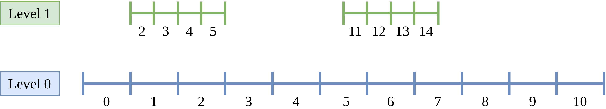

Apply an operator on a set
==========================

When adaptive mesh algorithms are implemented, it is common to apply a certain operator on a portion of the mesh: updating the ghosts, applying a projection operator between level `l` and `l-1`, ... A simple procedure is therefore needed to identify this portion even if the mesh structure is complex and to be able to perform an operation on it.

|project| is composed of two key elements to achieve easily this goal: the intervals and a set algebra. :cpp:class:`samurai::CellArray` is used to store a mesh with several cartesian grids at different levels of resolution. These sub meshes are stored as an array of intervals in each direction.

Let's create two sub meshes using :cpp:class:`samurai::CellList` and :cpp:class:`samurai::CellArray`.

.. code-block:: c++

    constexpr std::size_t dim = 1;

    samurai::CellList<dim> cl;
    cl[0][{}].add_interval({0, 10});
    cl[1][{}].add_interval({2, 6});
    cl[1][{}].add_interval({11, 15});

    samurai::CellArray<dim> ca(cl, true);

In this example, two 1D intervals are created on two different levels.

The boolean parameter for the construction of `ca` indicates that we want to compute the index in each 1D interval to be able to attach a field on it.

The output of

.. code-block:: c++

    std::cout << ca << std::endl;

is

.. code-block::

    ┌────────────────────┐
    │      Level 0       │
    └────────────────────┘
        dim 0
                cells = [0, 10[@0:1

    ┌────────────────────┐
    │      Level 1       │
    └────────────────────┘
        dim 0
                cells = [2, 6[@8:1 [11, 15[@3:1

Now, we want to find the intersection between these two levels. In |project|, several set algebra operators are already defined such as intersection, union, or difference. And new ones can be easily added.

The intersection can be written as

.. code-block:: c++

    auto set = samurai::intersection(ca[0], ca[1]);

We can apply an operator on this subset to be sure that it is effectively the intersection. For that, we use the `operator()` of the subset.

.. code-block:: c++

    set([&](const auto& i, auto)
    {
        std::cout << "intersection found in " << i << std::endl;
    });

This operator takes a lambda function with two parameters: the first one is the interval found in the x-direction, and the second one is an array with the size of `dim - 1` with the coordinates of the other dimensions. Since we study a 1D problem, we don't use this second parameter.

The output is

.. code-block::

    intersection found in [2,6[@0:1
    intersection found in [11,15[@0:1

The result is automatically computed on the level `1`. At the construction of the subset, the largest level is chosen to compute the result. It is possible to modify this default behavior by indicating with `on(this_level)` the level where we want the result.

Then if we want the result on level `0`

.. code-block:: c++

    set.on(0)([&](const auto& i, auto)
    {
        std::cout << "intersection found in " << i << std::endl;
    });

The output is

.. code-block::

    intersection found in [1,3[@0:1
    intersection found in [5,8[@0:1

It is also possible to make this intersection on a level which doesn't exist in our mesh

.. code-block:: c++

    set.on(3)([&](const auto& i, auto)
    {
        std::cout << "intersection found in " << i << std::endl;
    });

The output is

.. code-block::

    intersection found in [8,24[@0:1
    intersection found in [44,60[@0:1

The other set algebra operators work exactly the same. For example, the difference can be written as

.. code-block:: c++

    auto set = samurai::difference(ca[0], ca[1]);

And the output is

.. code-block::

    difference found in [0,2[@0:1
    difference found in [6,11[@0:1
    difference found in [15,20[@0:1

Now, we want to create a field on the mesh and apply an operator to it on a portion of the mesh using the operators introduced previously.

The creation of a field is

.. code-block:: c++

    auto u = samurai::make_field<double, 1>("u", ca);

We initialize it only on level `1` and set the other values to zero.

.. code-block:: c++

    u.fill(0);
    samurai::for_each_cell(ca[1], [&](auto cell)
    {
        u[cell] = cell.indices[0];
    });

It works as `std::array`: the type of the date must be set (here `double`) and the number of elements on each cell (here `1`).

In the next part, we will apply a projection operator on cells that have a full intersection between level `0` and level `1` as explained in this figure

.. image:: ./figures/subset_op_proj.png
    :width: 80%
    :align: center

This projection operator is just the average of the two fine cells. The result is set in the coarse cell.

.. code-block:: c++

    auto subset = samurai::intersection(ca[0], ca[1])
                 .on(0);
    subset([&](const auto& i, auto)
    {
        u(0, i) = 0.5 * (u(1, 2 * i) + u(1, 2 * i + 1));
    });

If we try to execute this code, we will have this output

.. code-block::

    [critical] READ OR WRITE FIELD ERROR on level 1: try to find interval [11, 17[@0:2
    [critical] READ OR WRITE FIELD ERROR on level 1: try to find interval [10, 16[@0:2

meaning that we try to read values in the field at an interval that doesn't exist.

Use the contraction operator

.. code-block:: c++

    auto subset = samurai::intersection(ca[0], samurai::contraction(ca[1]))
                 .on(0);
    subset([&](const auto& i, auto)
    {
        u(0, i) = 0.5 * (u(1, 2 * i) + u(1, 2 * i + 1));
    });

We can create an operator that works for different dimensions

.. code-block:: c++

    template<class TInterval>
    class projection_op: public samurai::field_operator_base<TInterval>
    {
    public:
        INIT_OPERATOR(projection_op)

        template<class T>
        inline void operator()(samurai::Dim<1>, T& field) const
        {
            field(level, i) = .5 * (field(level + 1, 2 * i) + field(level + 1, 2 * i + 1));
        }

        template<class T>
        inline void operator()(samurai::Dim<2>, T& field) const
        {
            field(level, i, j) = .25 * (field(level + 1, 2 * i, 2 * j) +
                                        field(level + 1, 2 * i, 2 * j + 1) +
                                        field(level + 1, 2 * i + 1, 2 * j) +
                                        field(level + 1, 2 * i + 1, 2 * j + 1));
        }

        template<class T>
        inline void operator()(samurai::Dim<3>, T& field) const
        {
            field(level, i, j, k) = .125 * (field(level + 1, 2 * i, 2 * j, 2 * k) +
                                            field(level + 1, 2 * i + 1, 2 * j, 2 * k) +
                                            field(level + 1, 2 * i, 2 * j + 1, 2 * k) +
                                            field(level + 1, 2 * i + 1, 2 * j + 1, 2 * k) +
                                            field(level + 1, 2 * i, 2 * j + 1, 2 * k + 1) +
                                            field(level + 1, 2 * i + 1, 2 * j + 1, 2 * k + 1));
        }
    };

    template<class T>
    inline auto projection(T&& field)
    {
        return samurai::make_field_operator_function<projection_op>(std::forward<T>(field));
    }

The following code shows how to use it

.. code-block:: c++

    auto subset = samurai::intersection(ca[0], samurai::contraction(ca[1]))
                 .on(0);
    subset.apply_op(projection);