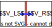
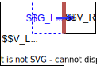
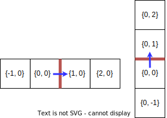

=====================
Finite Volume schemes
=====================

The Finite Volume module provides a framework for the implementation of Finite Volume schemes on adapted meshes.
It allows you to make use of readily-available Finite Volume operators, such as diffusion, convection and divergence operators, and implement your own flux functions.

To enable it, use

.. code-block:: c++

    #include <samurai/schemes/fv.hpp>
    #include <samurai/petsc.hpp> // optional, necessary for implicit schemes

In the Finite Volume method (FVM), the computed values correspond to average values, in control volumes, of the physical variables involved.
The mathematical system of equations is therefore integrated locally over each control volume :math:`V`.
Let :math:`u` denote a generic, conservative data field, and :math:`\mathcal{D}(u)` a differential term to be integrated over the volume :math:`V`.
In order to ensure flux conservation, the integral over :math:`V` is rewritten as a sum of fluxes passing through the faces of :math:`V`, i.e.

.. math::
    \int_V \mathcal{D}(u) = \int_{\partial V} \mathcal{F}(u),

where :math:`\mathcal{F}` is the flux function associated to the differential operator :math:`\mathcal{D}`.
For each differential operator, the expression of :math:`\mathcal{F}` is given by Green's theorem or its derived formulas.
For instance, if :math:`\mathcal{D}(u) = \Delta u`, then :math:`\mathcal{F}(u) = \nabla u\cdot \mathbf{n}`,
where :math:`\mathbf{n}` denotes the unit vector normal to :math:`\partial V` pointing out of :math:`V`.
In the discrete setting, :math:`\partial V` decomposes into a set of faces,
and for each face :math:`F`, the flux :math:`\mathcal{F}(u)` is approximated by a discrete counterpart :math:`\mathcal{F}_h(u_h)`.
This approximation is assumed constant on each face, thus simplifying the integral into

.. math::
    \int_{\partial V} \mathcal{F}(u) = \sum_{F\subset \partial V}\int_F \mathcal{F}(u) \approx \sum_{F\subset \partial V} |F| \mathcal{F}_h(u_h)_{|F}.

In a nutshell, from a :code:`samurai` mesh and an implementation of :math:`\mathcal{F}_h(u_h)`, the Finite Volume module builds a discrete differential operator
that can be called like a function in an explicit context, or passed into a solver in an implicit context.
Specifically, upon execution, it iterates over all cell interfaces :math:`F` and computes the flux :math:`\mathcal{F}_h(u_h)_{|F}` going through.

Denoting :math:`V_L` and :math:`V_R` the two cells sharing the face :math:`F`, and ordered in the direction of the corresponding Cartesian vector
(i.e., in the x-direction, :math:`V_L` and :math:`V_R` are the left and right cells, respectively),
the scheme contributions are defined as

.. math::

    \mathcal{C}_L &:= \;\;\; \frac{|F|}{|V_L|} \mathcal{F}_h(u_h)_{|F}, \\
    \mathcal{C}_R &:=      - \frac{|F|}{|V_R|} \mathcal{F}_h(u_h)_{|F}.

The flux :math:`\mathcal{F}_h(u_h)_{|F}` is computed only once and used for both contributions.

.. note::

    Flux conservation imposes that the flux in one direction be the opposite of that in the opposite direction.
    Defining two fluxes :math:`\mathcal{F}_h^+(u_h)_{|F}` and :math:`\mathcal{F}_h^-(u_h)_{|F}` such that :math:`\mathcal{F}_h^-(u_h)_{|F} \neq -\mathcal{F}_h^+(u_h)_{|F}` is also possible.
    Refer to :ref:`non conservative schemes <non_conservative_schemes>`.

Where level jumps occur, ghost cells are involved in the computation of :math:`\mathcal{F}_h(u_h)_{|F}`, so that it is always computed between two cells of same length.

:math:`V_L` and :math:`V_R` still refer to real cells in the formulas of :math:`\mathcal{C}_L` and :math:`\mathcal{C}_R`.

.. note::

    You can remark that the contributions are divided by the measure of the corresponding cell.
    Instead of :math:`\int_V \mathcal{D}(u)`,
    we actually compute :math:`\frac{1}{|V|} \int_V \mathcal{D}(u)`.
    This choice is designed to avoid multiplying the discrete source terms by the cell measures.

Implementing a Finite Volume scheme
-----------------------------------

Consider the implementation of a differential operator :math:`\mathcal{D}` that applies to a field :math:`u`.
Let :math:`v` denote the resulting field:

.. math::
    v = \mathcal{D}(u).

Static configuration
++++++++++++++++++++

First of all, the structural information about the scheme must be declared.
It contains:

- the :code:`input_field_type`: the C++ type of the field :math:`u`.
- the :code:`output_field_size`: the field size of the resulting field :math:`v`.
  For instance, the size of :math:`\nabla u`, if :math:`u` is a scalar field, is the space dimension.
- the :code:`stencil_size`: the size of the stencil required to compute the flux.
  A typical low-order scheme requires a stencil of two cells.
- the :code:`scheme_type`, to be selected amongst the values of

.. code-block:: c++

    enum class SchemeType
    {
        NonLinear,
        LinearHeterogeneous,
        LinearHomogeneous
    };

This configuration must be declared in a :code:`FluxConfig` static structure.
Here is an example for the vectorial Laplace operator:

.. code-block:: c++

    // Creation of a field 'u' of size 2
    auto u = samurai::make_field<2>("u", mesh);

    // Configuration for the Laplace operator
    using cfg = samurai::FluxConfig<SchemeType::LinearHomogeneous, // scheme_type
                                    decltype(u)::size,             // output_field_size (here identical to the input field size)
                                    2,                             // stencil_size (for the Laplacian of order 2)
                                    decltype(u)>;                  // input_field_type

.. _stencil-configuration:

Stencil configuration
+++++++++++++++++++++

From :code:`cfg`, you can now declare a :code:`FluxDefinition` object to hold how the flux is computed.

.. code-block:: c++

    samurai::FluxDefinition<cfg> my_flux;

In each direction, the flux is computed between one cell and its neighbour following the associated Cartesian unit vector.
Namely, in 2D, from left to right and from bottom to top.
The stencil is defined as an array of directional vectors from the origin cell. The origin cell is defined as the left cell in the horizontal direction, or the bottom cell in the vertical direction.
It is represented by the zero vector :code:`{0,0}` (or :code:`{0,0,0}` in 3D).
The desired neighbours are selected by inserting into the stencil the direction vectors that capture them from the origin cell.
Typically, for the x-direction, the stencil :code:`{{0,0}, {1,0}}` captures the origin cell and its right neighbour.
Here is an example of larger stencils:

In this figure, four cells are required to compute the flux at the red interface. The orientation of the flux is indicated by a blue arrow.
In each cell, we specify the direction vector that must be inserted into the stencil to capture it.
The corresponding stencils are configured by

.. code-block:: c++

    samurai::FluxDefinition<cfg> my_flux;

    // x-direction
    my_flux[0].stencil = {{-1,0}, {0,0}, {1,0}, {2,0}};
    my_flux[0].cons_flux_function = my_flux_function_x;
    // y-direction
    my_flux[1].stencil = {{0,-1}, {0,0}, {0,1}, {0,2}};
    my_flux[1].cons_flux_function = my_flux_function_y;

Note that one stencil and associated flux function must be defined for each positive Cartesian direction.
The set of cells captured by the stencil will be passed as argument of the flux function in the form of a cell array, arranged according the order chosen in the configured stencil:

.. code-block:: c++

    my_flux[0].stencil = {{-1,0}, {0,0}, {1,0}, {2,0}};
    my_flux[0].cons_flux_function = 
        {
            auto& L2 = cells[0]; // {-1,0}
            auto& L1 = cells[1]; // { 0,0}
            auto& R1 = cells[2]; // { 1,0}
            auto& R2 = cells[3]; // { 2,0}
        };

Helper functions allow you to easily build line stencils (such as the one above) for any direction:

.. code-block:: c++

    // x-direction
    my_flux[0].stencil = samurai::line_stencil<dim, 0>(-1, 0, 1, 2); // {{-1,0}, {0,0}, {1,0}, {2,0}}
    // y-direction
    my_flux[1].stencil = samurai::line_stencil<dim, 1>(-1, 0, 1, 2); // {{0,-1}, {0,0}, {0,1}, {0,2}}

In this code, the second template parameter is the direction index. In the dynamic arguments, :code:`0` still represents the origin cell and the other numbers its neighbours following that direction.
Alternatively, instead of enumerating the neighbours, you can set only the farthest neighbour in the opposite direction along with the stencil size:

.. code-block:: c++

    // x-direction
    my_flux[0].stencil = samurai::line_stencil_from<dim, 0, 4>(-1); // {{-1,0}, {0,0}, {1,0}, {2,0}}
    // y-direction
    my_flux[1].stencil = samurai::line_stencil_from<dim, 1, 4>(-1); // {{0,-1}, {0,0}, {0,1}, {0,2}}

This code is strictly equivalent to the preceding one. The second template parameter is still the direction index, and the third one is the stencil size.
The dynamic argument, here :code:`-1`, represents the first neighbour of the sequence.

These helper functions allow you to write :math:`n`-dimensional code through a static loop over the dimensions:

.. code-block:: c++

    samurai::static_for<0, dim>::apply( // for each Cartesian direction 'd'
        [&](auto integral_constant_d)
        {
            static constexpr int d = decltype(integral_constant_d)::value;

            my_flux[d].stencil = samurai::line_stencil<dim, d>(-1, 0, 1, 2);
        }

If the stencil is not specified, a the line stencil corresponding to the :code:`stencil_size` stencil is used.
If :code:`stencil_size` is even, then the selected neighbours are evenly distributed on both sides of the interface. If it is odd, there is one more neighbour in the positive direction.

.. note::
    If the stencil depends on the value of a dynamic parameter (e.g., in the upwind or WENO schemes, the sign of the local velocity component),
    then a fixed stencil composed of all cells possibly used by the scheme must be configured.
    The selection of the cells actually used in the computation must be performed dynamically within the flux function.
    See the :ref:`upwind operator <upwind_conv_operator>` for an example.

Flux definition
+++++++++++++++

The flux function must be defined for each positive Cartesian direction. Here in 2D:

.. code-block:: c++

    samurai::FluxDefinition<cfg> my_flux;
    my_flux[0].cons_flux_function = my_flux_function_x; // flux in the x-direction
    my_flux[1].cons_flux_function = my_flux_function_y; // flux in the y-direction

In this generic code, the flux functions remain abstract:
their signatures actually depend on the :code:`SchemeType` declared in :code:`cfg`, and are described in the next sections.
If the flux functions only differ by the direction index, you can write an :math:`n`-dimensional code by using a static loop instead of the above sequence of affectations:

.. code-block:: c++

    static constexpr std::size_t dim = 2;

    samurai::FluxDefinition<cfg> my_flux;
    samurai::static_for<0, dim>::apply( // for (int d=0; d<dim; d++)
            [&](auto integral_constant_d)
            {
                static constexpr int d = decltype(integral_constant_d)::value; // get the static direction index

                my_flux[d].cons_flux_function = my_flux_function_d;
            });

If the flux function is strictly identical for all directions, you can simply pass it into the constructor:

.. code-block:: c++

    samurai::FluxDefinition<cfg> my_flux(my_flux_function);

Operator creation and usage
+++++++++++++++++++++++++++

Once the :code:`FluxDefinition` object is constructed, you can finally declare your operator by

.. code-block:: c++

    auto D = samurai::make_flux_based_scheme(my_flux);

and use it in an explicit context

.. code-block:: c++

    auto v = D(u);

or in an implicit context

.. code-block:: c++

    auto rhs = samurai::make_field<...>("rhs", mesh); // right-hand side
    samurai::petsc::solve(D, u, rhs); // solves the equation D(u) = rhs

Note that the :code:`solve` function involves a linear or a non-linear solver according to the :code:`SchemeType` declared in :code:`cfg`.

The definition of actual flux functions according the selected :code:`SchemeType` is described in the next sections.

.. _lin_homog_operators:

Linear, homogeneous operators
-----------------------------

This section refers to operators configured with :code:`SchemeType::LinearHomogeneous`.
In order to handle explicit and implicit schemes with the same definition,
the user-defined flux function does not directly compute the discrete flux :math:`\mathcal{F}_h(u_h)`.
Instead, it must return a set of coefficients.
Indeed, given a face :math:`F` and the associated stencil :math:`(V_i)_i`,
the discrete flux writes as a linear combination of the field values in the stencil cells, i.e.

.. math::
    :label: linear_comb

    \mathcal{F}_h(u_h)_{|F} := \sum_i c_i*u_i, \qquad \text{ where } u_i := (u_h)_{|V_i}.

The role of the flux function is to return the coefficients :math:`(c_i)_i`.
Its implementation looks like

.. code-block:: c++

    auto my_flux_function = 
    {
        FluxStencilCoeffs<cfg> c;

        // Assuming a 2-cell stencil:
        c[0] = ...
        c[1] = ...

        return c;
    };

The :code:`FluxStencilCoeffs<cfg>` object is an array-like structure of fixed-size.
Its size is the :code:`stencil_size` declared in :code:`cfg`.
Each :code:`c[i]` is a matrix of size :code:`output_field_size x input_field_size`,
where :code:`output_field_size` is set in :code:`cfg`,
and :code:`input_field_size` corresponds to the size of the field type set in :code:`cfg` as :code:`input_field_type`.
The matrix type is in fact an :code:`xtensor` object.
You can then, amongs other things, access the :math:`k`-th row of :code:`c[0]` via :code:`xt::row(c[0], k)`,
its :math:`l`-th column via :code:`xt::col(c[0], l)`, or its coefficient at indices :math:`(k, l)` via :code:`c[0](k, l)`.

.. note::
    When both :code:`output_field_size` and :code:`input_field_size` equal 1,
    the matrix type employed to store the coefficents reduces to a scalar type (typically :code:`double`).
    In particular, no accessor or :code:`xtensor` function is available.
    To write an :math:`n`-dimensional program, a separate code for the special case where the matrix reduces to a scalar is usually necessary.

As the operator is declared homogenous over the mesh, the coefficients do not depend on specific cell values.
They can, however, depend on the mesh size :math:`h`, making :math:`h` the only parameter of the flux function.
The coefficients can then be computed only once per mesh level, and re-used for all interfaces.
If other (constant!) parameters are needed, they can be captured by the lambda function.

This implementation as a set of coefficients instead of the direct computation of the flux via an explicit formula
allows the framework to handle both explicit and implicit schemes.
Namely, the same coefficients will be used differently according to the context:

- in an explicit context, they will be used as coefficients in the linear combination of the stencil values (formula :eq:`linear_comb`).
- in an implicit context, they will be inserted into the matrix that will be inverted.

As examples, we implement various standard operators in the next sections.

Scalar laplacian
++++++++++++++++

Since we have

.. math::
    \int_V \Delta u = \int_{\partial V} \nabla u\cdot \mathbf{n},

the flux function to implement is a discrete version of :math:`\nabla u\cdot \mathbf{n}`.
Here, we choose the normal gradient of the first order, requiring a stencil of two cells.
This is enough to write the static configuration:

.. code-block:: c++

    auto u = samurai::make_field<1>("u", mesh); // scalar field

    using cfg = samurai::FluxConfig<SchemeType::LinearHomogeneous,
                                    1,            // output_field_size
                                    2,            // stencil_size
                                    decltype(u)>; // input_field_type

Now, denoting by :math:`V_L` (left) and :math:`V_R` (right) the stencil cells and :math:`F` their interface, the discrete flux from :math:`V_L` to :math:`V_R` writes

.. math::
    \mathcal{F}_h(u_h)_{|F} := \frac{u_R-u_L}{h},

where :math:`u_L` and :math:`u_R` are the finite volume approximations of :math:`u` in the respective cells, and :math:`h` is the cell length.
Referring to formula :eq:`linear_comb`, the coefficients in the linear combination of :math:`(u_L, u_R)` correspond to :math:`(-1/h, 1/h)`.
The flux function then writes:

.. code-block:: c++

    samurai::FluxDefinition<cfg> gradient(
        {
            static constexpr std::size_t L = 0; // left
            static constexpr std::size_t R = 1; // right

            samurai::FluxStencilCoeffs<cfg> c;
            c[L] = -1/h;
            c[R] =  1/h;
            return c;
        });

First of all, remark that we have declared only one flux function for all directions.
We could have written as many functions as directions:
they would have been identical, except that we would have replaced the name of the constants
:code:`L=0, R=1` with :code:`B=0, T=1` (bottom, top) and :code:`B=0, F=1` (back, front) to better reflect the actual direction currently managed.
The indexes 0 and 1 actually refer to the configured stencil.
In this case, no particular stencil has been defined, so the default ones are used: in the x-direction of a 3D space,
it is :code:`{{0,0,0}, {1,0,0}}`, i.e. the current cell at index 0 (which we call :code:`L`) and its right neighbour at index 1 (which we call :code:`R`).

Finally, the operator must be constructed from the flux definition by the instruction

.. code-block:: c++

    auto laplacian = samurai::make_flux_based_scheme(gradient);

The Laplace operator can also be viewed as the divergence of the gradient, so the following definition using the divergence function is also possible:

.. code-block:: c++

    auto laplacian = samurai::make_divergence(gradient);

Indeed, as the divergence theorem reads

.. math::
    \int_V \nabla\cdot f(u) = \int_{\partial V} f(u) \cdot \mathbf{n},

the function :code:`make_divergence` is simply an alias of :code:`make_flux_based_scheme`, only meant to improve code readability.

Vector laplacian
++++++++++++++++

Formula :eq:`linear_comb` straightforwardly generalizes to a vectorial field :math:`\mathbf{u}_h` of size :code:`field_size`:

.. math::
    \mathcal{F}_h(\mathbf{u}_h)_{|F} := \sum_i \mathbf{c}_i*\mathbf{u}_i, \qquad \text{ where } \mathbf{u}_i := (\mathbf{u}_h)_{|V_i}

:math:`(\mathbf{u}_i)_i` are now vectors of size :code:`field_size` and :math:`(\mathbf{c}_i)_i` are now matrices of size :code:`field_size`:math:`\times`:code:`field_size`.
For :code:`field_size = 2`, the same scheme as the scalar laplacian writes,

.. math::
    \mathcal{F}_h(\mathbf{u}_h)_{|F} :=
    \begin{bmatrix} -1/h & 0 \\ 0 & -1/h \end{bmatrix} \mathbf{u}_L +
    \begin{bmatrix}  1/h & 0 \\ 0 &  1/h \end{bmatrix} \mathbf{u}_R.

The matrix data structure is based on the :code:`xtensor` library.
You can use the xtensor syntax and access functions to manipulate matrices.
The implementation of the vector laplacian operator then writes

.. code-block:: c++

    static constexpr std::size_t field_size = 3;
    auto u = samurai::make_field<field_size>("u", mesh); // vector field

    using cfg = samurai::FluxConfig<SchemeType::LinearHomogeneous,
                                    field_size,   // output_field_size
                                    2,            // stencil_size
                                    decltype(u)>; // input_field_type

    samurai::FluxDefinition<cfg> gradient(
        {
            static constexpr std::size_t L = 0;
            static constexpr std::size_t R = 1;

            samurai::FluxStencilCoeffs<cfg> c;
            c[L].fill(0);
            c[R].fill(0);
            for (std::size_t i = 0; i < field_size; ++i)
            {
                c[L](i, i) = -1/h;
                c[R](i, i) =  1/h;
            }
            return c;
        });

    auto laplacian = samurai::make_divergence(gradient);

Compared to the scalar laplacian code:

- in the configuration, the :code:`output_field_size` now equals the :code:`field_size`,
- in the flux fonction, the coefficients for each cell of the stencil are now matrices.
  Specifically, they are diagonal matrices with the same coefficients as in the scalar laplacian.

When :code:`field_size = 1`, the matrix type actually reduces to a scalar type, thus forbidding instructions such as :code:`c[L](i, i)`.
In order to manage all cases with one code, you must write

.. code-block:: c++

    if constexpr (field_size == 1)
    {
        c[L] = -1/h;
        c[R] =  1/h;
    }
    else
    {
        c[L].fill(0);
        c[R].fill(0);
        for (std::size_t i = 0; i < field_size; ++i)
        {
            c[L](i, i) = -1/h;
            c[R](i, i) =  1/h;
        }
    }

Gradient
++++++++

To implement the gradient of a scalar field as Finite Volume scheme, we write

.. math::
    \int_V \nabla u = \int_{\partial V} u\, \mathbf{n}.

The flux function to implement is then a discrete version of :math:`u\, \mathbf{n}`.
Here, we choose

.. math::
    \mathcal{F}_h(u_h)_{|F} := \frac{u_L+u_R}{2} \, \mathbf{n}

in all directions, i.e., in 2D

.. math::
    \mathcal{F}_h(u_h)_{|F} :=
    \begin{cases}
        \begin{bmatrix}
            \frac{u_L+u_R}{2} \\ 0
        \end{bmatrix}
        & \text{if } \mathbf{n} = \begin{bmatrix} 1 \\ 0 \end{bmatrix} \\
        \begin{bmatrix}
            0 \\ \frac{u_B+u_T}{2}
        \end{bmatrix}
        & \text{if } \mathbf{n} = \begin{bmatrix} 0 \\ 1 \end{bmatrix}
    \end{cases},

where :math:`B` and :math:`T` refer to bottom and top cells.

In the configuration, :code:`output_field_size` is set to the space dimension:

.. code-block:: c++

    static constexpr std::size_t dim = decltype(mesh)::dim;

    auto u = samurai::make_field<1>("u", mesh); // scalar field

    using cfg = samurai::FluxConfig<SchemeType::LinearHomogeneous,
                                    dim,          // output_field_size
                                    2,            // stencil_size
                                    decltype(u)>; // input_field_type

This time, the flux functions are different in each direction.
In 2D, they write:

.. code-block:: c++

    static constexpr std::size_t x = 0;
    static constexpr std::size_t y = 1;

    samurai::FluxDefinition<cfg> flux;

    flux[x].cons_flux_function = 
    {
        static constexpr std::size_t L = 0;
        static constexpr std::size_t R = 1;

        samurai::FluxStencilCoeffs<cfg> c;
        xt::row(c[L], x) = 0.5;
        xt::row(c[L], y) = 0;

        xt::row(c[R], x) = 0.5;
        xt::row(c[R], y) = 0;
        return c;
    };

    flux[y].cons_flux_function = 
    {
        static constexpr std::size_t B = 0;
        static constexpr std::size_t T = 1;

        samurai::FluxStencilCoeffs<cfg> c;
        xt::row(c[B], x) = 0;
        xt::row(c[B], y) = 0.5;

        xt::row(c[T], x) = 0;
        xt::row(c[T], y) = 0.5;
        return c;
    };

Here, the type :code:`FluxStencilCoeffs<cfg>` contains, for each cell in the stencil, a matrix of size :code:`dim x 1`, where :code:`dim` is the space dimension.
The flux in the x-direction computes a gradient with non-zero value only in the :math:`x` coordinate;
the flux in the y-direction computes a gradient with non-zero value only in the :math:`y` coordinate.

This code can be compacted into the :math:`n`-dimensional code

.. code-block:: c++

    samurai::FluxDefinition<cfg> flux;
    samurai::static_for<0, dim>::apply(
        [&](auto integral_constant_d)
        {
            static constexpr int d = decltype(integral_constant_d)::value; // direction index

            flux[d].cons_flux_function = 
            {
                static constexpr std::size_t L = 0;
                static constexpr std::size_t R = 1;

                samurai::FluxStencilCoeffs<cfg> c;
                c[L].fill(0);
                xt::row(c[L], d) = 0.5;

                c[R].fill(0);
                xt::row(c[R], d) = 0.5;
                return c;
            };
        });

When :code:`dim = 1`, the matrix type in :code:`FluxStencilCoeffs<cfg>` actually reduces to a scalar type.
In order to manage all cases with one code, the content of the flux function evolves into

.. code-block:: c++

    if constexpr (dim == 1)
    {
        c[L] = 0.5;
        c[R] = 0.5;
    }
    else
    {
        c[L].fill(0);
        xt::row(c[L], d) = 0.5;

        c[R].fill(0);
        xt::row(c[R], d) = 0.5;
    }

Finally, we create the operator:

.. code-block:: c++

    auto grad = make_flux_based_scheme(flux);

Divergence
++++++++++

To implement the divergence of a vector field :math:`\mathbf{u}` as Finite Volume scheme, we write

.. math::
    \int_V \nabla \cdot \mathbf{u} = \int_{\partial V} \mathbf{u} \cdot \mathbf{n}.

The flux function to implement is then a discrete version of :math:`\mathbf{u} \cdot \mathbf{n}`.
Similarly to the gradient operator above, we choose the average value to approximate :math:`\mathbf{u}`.
In 2D, it yields

.. math::
    \mathcal{F}_h(u_h)_{|F} :=
    \begin{cases}
        \frac{(u_L)_x+(u_R)_x}{2} & \text{if } \mathbf{n} = \begin{bmatrix} 1 \\ 0 \end{bmatrix}, \\
        \frac{(u_B)_y+(u_T)_y}{2} & \text{if } \mathbf{n} = \begin{bmatrix} 0 \\ 1 \end{bmatrix}.
    \end{cases}

The linear combination :eq:`linear_comb` reads

.. math::
    \mathcal{F}_h(u_h)_{|F} :=
    \begin{cases}
        \mathbf{c}_L*\mathbf{u}_L + \mathbf{c}_R*\mathbf{u}_R & \text{if } \mathbf{n} = \begin{bmatrix} 1 \\ 0 \end{bmatrix}, \\
        \mathbf{c}_B*\mathbf{u}_B + \mathbf{c}_T*\mathbf{u}_T & \text{if } \mathbf{n} = \begin{bmatrix} 0 \\ 1 \end{bmatrix}.
    \end{cases}

In this formula, :math:`\mathcal{F}_h(u_h)_{|F}` is a scalar value and :math:`\mathbf{u}_L, \mathbf{u}_R` (resp. :math:`\mathbf{u}_B, \mathbf{u}_T`) are column-vectors.
Consequently, :math:`\mathbf{c}_L` and :math:`\mathbf{c}_R` (resp. :math:`\mathbf{c}_B` and :math:`\mathbf{c}_T`) are row-vectors.
Specifically, their C++ type corresponds to a matrix of size :code:`1 x dim`.
The considered scheme then writes

.. math::
    \begin{cases}
        \mathbf{c}_L := \begin{bmatrix} 1/2 &  0  \end{bmatrix}, & \mathbf{c}_R := \begin{bmatrix} 1/2 &  0  \end{bmatrix}, & \text{if } \mathbf{n} = \begin{bmatrix} 1 \\ 0 \end{bmatrix}, \\
        \mathbf{c}_B := \begin{bmatrix}  0  & 1/2 \end{bmatrix}, & \mathbf{c}_T := \begin{bmatrix}  0  & 1/2 \end{bmatrix}, & \text{if } \mathbf{n} = \begin{bmatrix} 0 \\ 1 \end{bmatrix}.
    \end{cases}

The following code corresponds directly to the :math:`n`-dimensional version:

.. code-block:: c++

    static constexpr std::size_t dim = decltype(mesh)::dim;

    auto u = samurai::make_field<dim>("u", mesh); // vector field

    using cfg = samurai::FluxConfig<SchemeType::LinearHomogeneous,
                                    1,            // output_field_size
                                    2,            // stencil_size
                                    decltype(u)>; // input_field_type

    samurai::FluxDefinition<cfg> flux;

    samurai::static_for<0, dim>::apply(
        [&](auto integral_constant_d)
        {
            static constexpr int d = decltype(integral_constant_d)::value;

            flux[d].cons_flux_function = 
            {
                static constexpr std::size_t L = 0;
                static constexpr std::size_t R = 1;

                samurai::FluxStencilCoeffs<cfg> c;
                if constexpr (dim == 1)
                {
                    c[L] = 0.5;
                    c[R] = 0.5;
                }
                else
                {
                    c[L].fill(0);
                    xt::col(c[L], d) = 0.5;

                    c[R].fill(0);
                    xt::col(c[R], d) = 0.5;
                }
                return c;
            };
        });

    auto div = samurai::make_flux_based_scheme(flux);

Note that it corresponds exactly to the code of the gradient operator, where the :code:`xt:row` functions have been replaced with :code:`xt:col`.

.. _lin_heter_operators:

Linear, heterogeneous operators
-------------------------------

This section refers to operators configured with :code:`SchemeType::LinearHeterogeneous`.
Heterogeneous operators are meant to implement linear fluxes that depend on parameters that are not constant in the domain of study.
The flux function resembles that of the :ref:`homogeneous linear operators <lin_homog_operators>`, except that it receives the stencil cells as arguments instead of the sole mesh size.

.. code-block:: c++

    auto param = samurai::make_field<...>("param", mesh)

    auto my_flux_function = [&](const auto& cells)
    {
        FluxStencilCoeffs<cfg> c;

        // Assuming a 2-cell stencil:
        c[0] = ... param[cell[0]] ...
        c[1] = ... param[cell[1]] ...

        return c;
    };

Here, the stencil cells of the computational stencil are provided, to be used to retrieved the values of the parameters in those cells.
The parameter is captured by reference by the lambda function.

.. warning::

    The provided cells correspond to the *computational* stencil. This is not the couple of real cells around the considered face.
    Where a level jump occurs, at least one of the computational cells is a ghost cell.
    Consequently, make sure that values are set for your parameters in the ghost cells.
    For a material parameter, you can do, e.g.

    .. code-block:: c++

        samurai::for_each_cell(mesh[decltype(mesh)::mesh_id_t::reference],
            [&](auto& cell)
            {
                if (cell.center(0) < 0 && cell.center(1) > 0.5)
                {
                    param[cell] = ...;
                }
                else
                {
                    param[cell] = ...;
                }
            });

    For a computed field used as a parameter (like, e.g., a velocity field computed from the Navier-Stokes equation), you can simply update the ghost values by

    .. code-block:: c++

        samurai::update_ghost_mr(param);

Here is an example:

.. _upwind_conv_operator:

Upwind convection
+++++++++++++++++

Let :math:`u` be a scalar field and :math:`\mathbf{a}` a velocity field.
We implement the operator :math:`\mathbf{a} \cdot \nabla u`.
Assuming that :math:`\mathbf{a}` is divergence-free (i.e. :math:`\nabla \cdot \mathbf{a} = 0`), we write

.. math::
    \int_V \mathbf{a} \cdot \nabla u = \int_{\partial V} u(\mathbf{a} \cdot \mathbf{n}).

The flux function to implement is then a discrete version of :math:`u(\mathbf{a} \cdot \mathbf{n})`.
Here, we choose the upwind scheme.
In each direction :math:`d`,

.. math::
    \mathcal{F}_h(u_h)_{|F} :=
    \begin{cases}
        u_L & \text{if } (\mathbf{a})_d \geq 0, \\
        u_R & \text{otherwise,}
    \end{cases}

where :math:`(\mathbf{a})_d` is the :math:`d`-th component of :math:`\mathbf{a}`.
Here, :math:`\mathbf{a}` is constant heterogeneous.
We store it in a field of size the space dimension, and set its value for each cell and ghost.

.. code-block:: c++

    static constexpr std::size_t dim = 2;

    auto a = samurai::make_field<dim>("velocity", mesh);

    samurai::for_each_cell(mesh[decltype(mesh)::mesh_id_t::reference],
            
            {
                if (cell.center(0) < 0)
                {
                    a[cell] = {1, -1};
                }
                else
                {
                    a[cell] = {-1, 1};
                }
            });

It is important to also set values into ghosts, since ghost cell may be used in the computational stencil.
The construction of the operator now reads

.. code-block:: c++

    auto u = samurai::make_field<1>("u", mesh); // scalar field

    using cfg = samurai::FluxConfig<SchemeType::LinearHeterogeneous,
                                    1,            // output_field_size
                                    2,            // stencil_size
                                    decltype(u)>; // input_field_type

    samurai::FluxDefinition<cfg> upwind;

    samurai::static_for<0, dim>::apply(
        [&](auto integral_constant_d)
        {
            static constexpr int d = decltype(integral_constant_d)::value;

            upwind[d].cons_flux_function = [&](const auto& cells)
            {
                static constexpr std::size_t L = 0;
                static constexpr std::size_t R = 1;

                auto cell = cells[L]; // arbitrary choice

                samurai::FluxStencilCoeffs<cfg> c;

                if (a[cell](d) >= 0)
                {
                    c[L] = a[cell](d);
                    c[R] = 0;
                }
                else
                {
                    c[L] = 0;
                    c[R] = a[cell](d);
                }
                return c;
            };
        });

    auto conv = samurai::make_flux_based_scheme(upwind);

Non-linear operators
--------------------

This section refers to operators configured with :code:`SchemeType::NonLinear`.
Here, the analytical formula computing the flux must be implemented.
The flux function is

.. code-block:: c++

    auto my_flux_function = 
    {
        samurai::FluxValue<cfg> flux_value;

        // Compute your flux using the field and the stencil cells

        return flux_value;
    };

Here, :code:`FluxValue<cfg>` is an array-like structure of size :code:`cfg::output_field_size`.
If :code:`cfg::output_field_size = 1`, it collapses to a simple scalar.

.. warning::

    The provided cells correspond to the *computational* stencil. This is not the couple of real cells around the considered face.
    Where a level jump occurs, at least one of the computational cells is a ghost cell.
    Consequently, make sure that values are set in the ghost cells for the considered field,
    typically with the instruction

    .. code-block:: c++

        samurai::update_ghost_mr(u);

Flux divergence
+++++++++++++++

We have

.. math::
    \int_V \nabla \cdot f(u) = \int_{\partial V} f(u)\cdot \mathbf{n},

so we have to implement

.. math::
    \mathcal{F}_h(u_h)_{|F} := f_h(u_h),

where :math:`f_h` is a discrete version of :math:`f(\cdot)\cdot \mathbf{n}`.
The simple centered scheme writes

.. math::
    f_h(u_h) := \frac{f(u_L) + f(u_R)}{2}.

The associated code yields

.. code-block:: c++

    samurai::FluxDefinition<cfg> f_h;

    samurai::static_for<0, dim>::apply(
        [&](auto integral_constant_d)
        {
            static constexpr int d = decltype(integral_constant_d)::value;

            auto f = 
            {
                samurai::FluxValue<cfg> f_v = ...;
                return f_v;
            };

            f_h[d].cons_flux_function = [f](auto& cells, const Field& u)
            {
                auto& L = cells[0];
                auto& R = cells[1];
                return (f(u[L]) + f(u[R])) / 2;
            };
        });

.. warning::

    If the flux function :code:`f_h` calls a continuous function :code:`f`, make sure :code:`f` still exists when :code:`f_h` is called.
    Typically, if the non-linear flux operator is created and returned by a function, and if :code:`f` is also defined inside that function's scope, it will be deallocated prior to its use.
    In situations like this, make sure that :code:`f` is captured **by value** by :code:`f_h`. This is done in the above example by the capture instruction :code:`[f]`.
    If :code:`f_h` also requires to capture other fields or parameters by reference, you can write :code:`[f,&]`.

To build the operator, you can use indifferently

.. code-block:: c++

    auto my_flux_op = samurai::make_flux_based_scheme(f_h);

or

.. code-block:: c++

    auto my_flux_op = samurai::make_divergence(f_h);

The latter function is simply an alias of :code:`make_flux_based_scheme`, proposed to improve code readability in the specific case where the operator is a flux divergence.

Convection
++++++++++

We implement the operator :math:`\nabla \cdot \mathbf{u}\otimes\mathbf{u}` for a vectorial field :math:`\mathbf{u}`.
Recall that if :math:`\nabla \cdot \mathbf{u} = 0`, it is equivalent to :math:`\mathbf{u} \cdot \nabla\mathbf{u}`.
We have

.. math::
    \int_V \nabla \cdot \mathbf{u}\otimes\mathbf{u} = \int_{\partial V} (\mathbf{u}\otimes\mathbf{u})\mathbf{n}.

Developped in 2D, where :math:`\mathbf{u} := [u\;v]`, it reads

.. math::
    (\mathbf{u}\otimes\mathbf{u})\mathbf{n} =
    \begin{bmatrix}
        u^2 & uv \\
        uv  & v^2
    \end{bmatrix}
    \mathbf{n}
    =
    \begin{cases}
        \begin{bmatrix} u^2 \\ uv \end{bmatrix} & \text{if } \mathbf{n} = \begin{bmatrix} 1 \\ 0 \end{bmatrix}, \\
        \begin{bmatrix} uv \\ v^2 \end{bmatrix} & \text{if } \mathbf{n} = \begin{bmatrix} 0 \\ 1 \end{bmatrix}.
    \end{cases}

We implement both cases as functions:

.. code-block:: c++

    auto f_x = 
    {
        samurai::FluxValue<cfg> f_u;
        f_u(0) = u(0) * u(0);
        f_u(1) = u(0) * u(1);
        return f_u;
    };

    auto f_y = 
    {
        samurai::FluxValue<cfg> f_u;
        f_u(0) = u(1) * u(0);
        f_u(1) = u(1) * u(1);
        return f_u;
    };

We choose the upwind scheme, and implement:

.. code-block:: c++

    samurai::FluxDefinition<cfg> upwind_f;

    // x-direction
    upwind_f[0].cons_flux_function = [f_x](auto& cells, const Field& u)
    {
        auto& L = cells[0]; // left
        auto& R = cells[1]; // right
        return u[L](0) >= 0 ? f_x(u[L]) : f_x(u[R]);
    };

    // y-direction
    upwind_f[1].cons_flux_function = [f_y](auto& cells, const Field& u)
    {
        auto& B = cells[0]; // bottom
        auto& T = cells[1]; // top
        return u[B](1) >= 0 ? f_y(u[B]) : f_y(u[T]);
    };

    return samurai::make_flux_based_scheme(upwind_f);

Now, given that for each direction :math:`d`, we have

.. math::
    (\mathbf{u}\otimes\mathbf{u})\mathbf{n} = u_d\, \mathbf{u},

where :math:`u_d` is the :math:`d`-th component of :math:`\mathbf{u}`, the code can be generalized in :math:`n` dimensions:

.. code-block:: c++

    samurai::FluxDefinition<cfg> upwind_f;

    samurai::static_for<0, dim>::apply(
        [&](auto integral_constant_d)
        {
            static constexpr int d = decltype(integral_constant_d)::value;

            auto f_d =  -> samurai::FluxValue<cfg>
            {
                return u(d) * u;
            };

            upwind_f[d].cons_flux_function = [f_d](auto& cells, const Field& u)
            {
                auto& L = cells[0];
                auto& R = cells[1];
                return u[L](d) >= 0 ? f_d(u[L]) : f_d(u[R]);
            };
        });

    return samurai::make_flux_based_scheme(upwind_f);

.. _non_conservative_schemes:

Implementing a non-conservative scheme
--------------------------------------

Flux-based, non-conservative schemes also exist.
Exemples can be found in two-phase flow simulation: while the scheme remains conservative within each phase, non-conservative fluxes can be computed at the interface between phases.

We recall :math:`V_L` and :math:`V_R`, the two cells sharing the face :math:`F`, and ordered in the direction of the corresponding Cartesian vector
(i.e., in the x-direction, :math:`V_L` and :math:`V_R` are the left and right cells, respectively).
In a conservative scheme, the respective contributions of :math:`F` on :math:`V_L` and :math:`V_R` are defined as

.. math::

    \mathcal{C}_L &:= \;\;\; \frac{|F|}{|V_L|} \mathcal{F}_h(u_h)_{|F}, \\
    \mathcal{C}_R &:=      - \frac{|F|}{|V_R|} \mathcal{F}_h(u_h)_{|F},

and flux :math:`\mathcal{F}_h(u_h)_{|F}` is computed only once and used for both contributions.

Now, the contributions of a non-conservative scheme read

.. math::

    \mathcal{C}_L &:= \frac{|F|}{|V_L|} \mathcal{F}_h^+(u_h)_{|F}, \\
    \mathcal{C}_R &:= \frac{|F|}{|V_R|} \mathcal{F}_h^-(u_h)_{|F},

where we do not necessarily have :math:`\mathcal{F}_h^-(u_h)_{|F} = -\mathcal{F}_h^+(u_h)_{|F}`.

Implementation-wise, while conservative schemes implement :math:`\mathcal{F}_h(u_h)_{|F}` through :code:`cons_flux_function`,
non-conservative ones return both values of :math:`\mathcal{F}_h^+(u_h)_{|F}` and :math:`\mathcal{F}_h^-(u_h)_{|F}` through :code:`flux_function`.
So far, only non-linear schemes are possible.
The signature is the same as :code:`flux_function`, except that it returns two values instead of one:

.. code-block:: c++

    samurai::FluxDefinition<cfg> my_flux;

    my_flux[0].flux_function = 
                               {
                                   samurai::FluxValuePair<cfg> flux;
                                   flux[0] = ...; // left --> right (direction '+')
                                   flux[1] = ...; // right --> left (direction '-')
                                   return flux;
                               };

Alternatively, you can also write

.. code-block:: c++

    my_flux[0].flux_function =  -> samurai::FluxValuePair<cfg>
                               {
                                   samurai::FluxValue<cfg> fluxLR = ...; // left --> right (direction '+')
                                   samurai::FluxValue<cfg> fluxRL = ...; // right --> left (direction '-')
                                   return {fluxLR, fluxRL};
                               };

For instance, conservativity can be enforced by

.. code-block:: c++

    my_flux[0].flux_function =  -> samurai::FluxValuePair<cfg>
                               {
                                   samurai::FluxValue<cfg> flux = ...;
                                   return {flux, -flux};
                               };

Available implementations
-------------------------

The following operators and schemes are available in the framework:

Diffusion
+++++++++

The diffusion operator :math:`-\nabla\cdot(K\nabla u)` is implemented with the classical scheme of order 2.
It applies to both scalar and vector fields.
Here are some examples according to the type of coefficient:

- Homogeneous, scalar coefficient:

.. code-block:: c++

    double K = 10;
    auto diff = samurai::make_diffusion_order2<FieldType>(K);

- Homogeneous, diagonal tensor coefficient:

.. code-block:: c++

    static constexpr std::size_t dim = 2;

    samurai::DiffCoeff<dim> K;
    K(0) = 1; // x-direction
    K(1) = 2; // y-direction

    auto diff = samurai::make_diffusion_order2<FieldType>(K);

- Heterogeneous, diagonal tensor coefficient:

.. code-block:: c++

    static constexpr std::size_t dim = 2;

    auto K = samurai::make_field<samurai::DiffCoeff<dim>, 1>("K", mesh);

    samurai::for_each_cell(mesh[decltype(mesh)::mesh_id_t::reference],
            [&](auto& cell)
            {
                double x = cell.center(0);
                K[cell] = x < 0 ? {1, 2} : {2, 1};
            });

    auto diff = samurai::make_diffusion_order2<FieldType>(K);

- Laplacian operator (equivalent to the diffusion operator with no minus sign and constant coefficient 1):

.. code-block:: c++

    auto lap = samurai::make_laplacian_order2<FieldType>();

Convection
++++++++++

The convection operators are accessible via the function :code:`make_convection_SCHEME<FieldType>(...)`, where :code:`SCHEME` must be replaced with the name of desired the discrete scheme.
Two discrete schemes are implemented: :code:`upwind` and :code:`weno5` (Jiang & Shu).
The mathematical operator implemented is :math:`\nabla \cdot (a \otimes u)`, which corresponds to :math:`a\cdot\nabla u` if :math:`a` is divergence-free.

- Linear convection with constant velocity:

.. code-block:: c++

    samurai::VelocityVector<dim> a = {1, -2};
    auto conv = samurai::make_convection_SCHEME<FieldType>(a);

- Linear convection with a velocity field:

.. code-block:: c++

    auto a = samurai::make_field<dim>("velocity", mesh); // the size must correspond to the space dimension
    auto conv = samurai::make_convection_SCHEME<FieldType>(a);

- Non-linear convection :math:`\nabla \cdot (u \otimes u)`:

.. code-block:: c++

    auto conv = samurai::make_convection_SCHEME<FieldType>();

Gradient
++++++++

The gradient operator is only implemented for scalar fields with the centered scheme of order 2.

.. code-block:: c++

    auto grad = samurai::make_gradient_order2<FieldType>();

Divergence
++++++++++

The gradient operator is only implemented for vector fields of size the space dimension, with the centered scheme of order 2.

.. code-block:: c++

    auto div = samurai::make_divergence_order2<FieldType>();

Identity
++++++++

The identity operator is only used for the implementation of implicit time stepping schemes.
Example of the heat equation

.. code-block:: c++

    auto u    = samurai::make_field<1>("u", mesh);
    auto unp1 = samurai::make_field<1>("unp1", mesh);

    auto diff = samurai::make_diffusion_order2<decltype(u)>();
    auto id   = samurai::make_identity<decltype(u)>();

    samurai::petsc::solve(id + dt*diff, unp1, u); // solves the linear equation [id + dt*diff](unp1) = u

Zero operator
+++++++++++++

The zero operator is used to build block matrices where one of the blocks is zero.
Example of the Stokes system:

.. code-block:: c++

    // Unknowns
    auto velocity = samurai::make_field<dim>("velocity", mesh);
    auto pressure = samurai::make_field<1>("pressure", mesh);

    // Stokes operator
    auto diff = samurai::make_diffusion_order2<decltype(velocity)>();
    auto grad = samurai::make_gradient_order2<decltype(pressure)>();
    auto div  = samurai::make_divergence_order2<decltype(velocity)>();
    auto zero = samurai::make_zero_operator<decltype(pressure)>();

    auto stokes = samurai::make_block_operator<2, 2>(diff, grad,
                                                     -div, zero);
    // Right-hand side
    auto f = samurai::make_field<dim>("f", mesh);
    auto z = samurai::make_field<1>("z", mesh, 0.);

    // Linear solver
    auto stokes_solver = samurai::petsc::make_solver(stokes);
    stokes_solver.set_unknowns(velocity, pressure);
    stokes_solver.solve(f, z);
