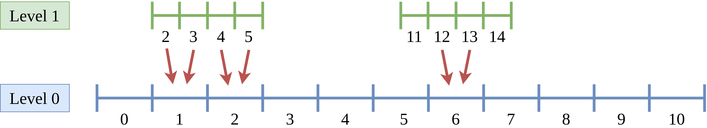

Apply an operator on a set
==========================

When adaptive mesh algorithms are deployed, it is common to apply a certain operator on a specific portion of the mesh.
The possible operations include the updating the ghosts, the application of a projection operator between level `l` and `l-1`, ..., etc.
A simple procedure is therefore needed to identify these portions even when the mesh structure is complex.

|project| is made up of two key elements to easily achieve this goal: the intervals and a set algebra.

Intervals
---------

As seen before, the class :cpp:class:`samurai::CellArray` is used to store a mesh with several cartesian grids at different levels of resolution.
These sub-meshes are stored as nothing but arrays of intervals in each direction.

To illustrate this purpose, let us create two sub-meshes using :cpp:class:`samurai::CellList` and :cpp:class:`samurai::CellArray`.

.. code-block:: c++

    constexpr std::size_t dim = 1;

    samurai::CellList<dim> cl;
    cl[0][{}].add_interval({0, 10});
    cl[1][{}].add_interval({2, 6});
    cl[1][{}].add_interval({11, 15});

    samurai::CellArray<dim> ca = cl;

In this example, two 1D intervals are created on two different levels.

.. image:: ./figures/subset_op.png
    :width: 80%
    :align: center

The output of

.. code-block:: c++

    std::cout << ca << std::endl;

is

.. code-block::

    ┌────────────────────┐
    │      Level 0       │
    └────────────────────┘
        dim 0
                cells = [0, 10[@0:1

    ┌────────────────────┐
    │      Level 1       │
    └────────────────────┘
        dim 0
                cells = [2, 6[@8:1 [11, 15[@3:1

Set algebra
-----------

Now, we want to find the intersection between the cells belonging to these two levels.
In |project|, several set algebra operators are built-in and ready to use.
They include:

* the intersection,
* the union,
* the difference.

Moreover, one can easily add custom operators to perform more complicated tasks.

We take the intersection for the sake of presenting an example.
It can be computed by

.. code-block:: c++

    auto set = samurai::intersection(ca[0], ca[1]);

Eventually, we could apply an operator on this subset to ensure that we obtained the actual intersection.
Once again, we use the `operator()` of the subset

.. code-block:: c++

    set([&](const auto& i, auto)
    {
        std::cout << "Intersection found in " << i << std::endl;
    });

This operator takes a lambda function with two parameters: the first one is the interval in the x-direction, whereas the second argument is an array of size `dim - 1` with the coordinates of the other dimensions.
Since we study a 1D problem, we do not utilize this second parameter.

The output we obtain is

.. code-block::

    intersection found in [2,6[@0:1
    intersection found in [11,15[@0:1

Remark that the result is automatically computed on level `1`.
Once constructing a subset, the largest available level between the different terms of the expression (`0` and `1` in the example) is chosen to compute the result.
Nevertheless, it is possible to modify this default behavior by indicating with `on(this_level)` the level where we want the result.

Then if we want the result on level `0`, we employ

.. code-block:: c++

    set.on(0)([&](const auto& i, auto)
    {
        std::cout << "intersection found in " << i << std::endl;
    });

The output is

.. code-block::

    intersection found in [1,3[@0:1
    intersection found in [5,8[@0:1

It is also possible to compute this intersection on a level which does not actually exist on our mesh, that is

.. code-block:: c++

    set.on(3)([&](const auto& i, auto)
    {
        std::cout << "intersection found in " << i << std::endl;
    });

The corresponding output is

.. code-block::

    intersection found in [8,24[@0:1
    intersection found in [44,60[@0:1

The remaining set algebra operators work exactly in the same fashion.
For example, the difference can be written as

.. code-block:: c++

    auto set = samurai::difference(ca[0], ca[1]);

And the corresponding output is

.. code-block::

    difference found in [0,2[@0:1
    difference found in [6,11[@0:1
    difference found in [15,20[@0:1

Again on operators over sets of cells
-------------------------------------

Now, we want to create a field on the mesh and to apply an operator modifying this field on a portion of the mesh, using the operators introduced previously.

The creation of a field with name `u` is achieved by

.. code-block:: c++

    auto u = samurai::make_field<double, 1>("u", ca);

We initialize it only on level `1` storing the cell indices obtained by :cpp:func:`indices` and set the other values to zero by filling them at the very beginning.

.. code-block:: c++

    u.fill(0);
    samurai::for_each_cell(ca[1], [&](auto cell)
    {
        u[cell] = cell.indices[0];
    });

Our fields work as `std::array`: the data type must be set at the declaration (here `double`) along with the number of elements on each cell (here `1`).

Then, we apply a projection operator on cells at level `0` which are completely covered by cells at level `1` (full intersection), as explained in this figure

where this property holds for the cells  `1`, `2` and `6` beneath the red arrows.

This projection operator is just the average of valus on the two fine cells. Thus, the result is set in the coarse cell.

.. code-block:: c++

    auto subset = samurai::intersection(ca[0], ca[1])
                 .on(0);
    subset([&](const auto& i, auto)
    {
        u(0, i) = 0.5 * (u(1, 2 * i) + u(1, 2 * i + 1));
    });

When trying to execute this code, we obtain the following output

.. code-block::

    [critical] READ OR WRITE FIELD ERROR on level 1: try to find interval [11, 17[@0:2
    [critical] READ OR WRITE FIELD ERROR on level 1: try to find interval [10, 16[@0:2

meaning that we try to read values in the field at an interval which does not exist.

In order to fix this issue, we consider the built-in contraction operator, which increments the start of each interval by 1 and decrements the end also by 1.
Considering the previous figure, this allows us to avoid considering cells on level `0` which are not completely covered by cells at the finer level `1`.

.. code-block:: c++

    auto subset = samurai::intersection(ca[0], samurai::contraction(ca[1]))
                 .on(0);
    subset([&](const auto& i, auto)
    {
        u(0, i) = 0.5 * (u(1, 2 * i) + u(1, 2 * i + 1));
    });

Operators working in many dimensions
------------------------------------

We now want to create an operator, similar to the previous projection operator, that works for different spatial dimensions.
This can be done in the following way, using template specialization

.. code-block:: c++

    template<class TInterval>
    class projection_op: public samurai::field_operator_base<TInterval>
    {
    public:
        INIT_OPERATOR(projection_op)

        template<class T>
        inline void operator()(samurai::Dim<1>, T& field) const
        {
            field(level, i) = .5 * (field(level + 1, 2 * i) + field(level + 1, 2 * i + 1));
        }

        template<class T>
        inline void operator()(samurai::Dim<2>, T& field) const
        {
            field(level, i, j) = .25 * (field(level + 1, 2 * i, 2 * j) +
                                        field(level + 1, 2 * i, 2 * j + 1) +
                                        field(level + 1, 2 * i + 1, 2 * j) +
                                        field(level + 1, 2 * i + 1, 2 * j + 1));
        }

        template<class T>
        inline void operator()(samurai::Dim<3>, T& field) const
        {
            field(level, i, j, k) = .125 * (field(level + 1, 2 * i, 2 * j, 2 * k) +
                                            field(level + 1, 2 * i + 1, 2 * j, 2 * k) +
                                            field(level + 1, 2 * i, 2 * j + 1, 2 * k) +
                                            field(level + 1, 2 * i + 1, 2 * j + 1, 2 * k) +
                                            field(level + 1, 2 * i, 2 * j + 1, 2 * k + 1) +
                                            field(level + 1, 2 * i + 1, 2 * j + 1, 2 * k + 1));
        }
    };

    template<class T>
    inline auto projection(T&& field)
    {
        return samurai::make_field_operator_function<projection_op>(std::forward<T>(field));
    }

This operator, which works for any dimension between one and three, can be employed using

.. code-block:: c++

    auto subset = samurai::intersection(ca[0], samurai::contraction(ca[1]))
                 .on(0);
    subset.apply_op(projection);

which automatically detects what is the dimensionality of the mesh one considers.
